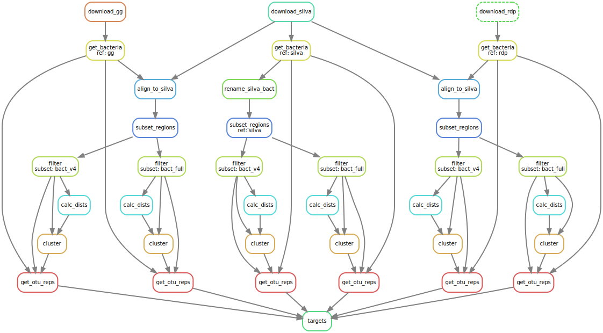

# OptiFitAnalysis

Benchmarking the optiFit algorithm in the mothur software package.

## Quickstart

1. Install the dependencies listed in `config/env.simple.yaml`.
2. Clone this repository.
    ```
    git clone https://github.com/SchlossLab/OptiFitAnalysis
    cd OptiFitAnalysis/
    ```
3. Edit the [configuration](https://github.com/SchlossLab/OptiFitAnalysis#snakemake-configuration) file as needed with your preferred text editor.
    ```
    vi config/config.yaml
    ```
4. [Run](https://github.com/SchlossLab/OptiFitAnalysis#running-a-workflow) the pipeline.

    Locally:
    ```
    snakemake
    ```
    Or on the cluster:
    ```
    qsub code/optiFit.pbs
    ```

5. Take a look at the results.
    * Each dataset has its own directory in `results/dataset-as-reference` and `results/silva-as-reference`. Within those directories:
        * The main output file is aggregated in `{dataset}/aggregate.sensspec`.
        * Results figures are in `{dataset}/figures/`.

6. Visualize the workflow.

    per-file:
    ```bash
    snakemake --dag | dot -T png > figures/dag.png
    ```

    per-rule:
    ```bash
    smk --rulegraph | dot -T png > figures/rulegraph.png
    ```

## Managing software dependencies

I'm using the [conda](https://conda.io/docs/) package manager to manage dependencies for this project.
If you don't already have it, I recommend installing the [Miniconda](https://conda.io/miniconda.html) Python 3 distribution.
[Here's a link](https://docs.conda.io/projects/conda/en/4.6.0/_downloads/52a95608c49671267e40c689e0bc00ca/conda-cheatsheet.pdf) to a helpful cheatsheet for using conda.
If you're experiencing slowness when solving conda environments, follow the suggestions [here](https://github.com/bioconda/bioconda-recipes/issues/13774).

### Create a conda environment

If you plan to run this workflow on Flux or another 64-bit Linux machine,
you can get an exact replica of my environment with:
```
conda env create --file config/env.export.yaml
```

Otherwise, run:
```
conda env create --name optiFit --file config/env.simple.yaml
```

The conda project is [in the process of merging conda-env into conda](https://groups.google.com/a/continuum.io/forum/#!topic/conda/EBVVtS8bNRA),
so the syntax for these commands may change.

### Activate

Activate the environment before running any code with:
```
conda activate optiFit
```
Be sure to activate the environment from the login node before submitting jobs on the cluster.

### Update the environment

Install new packages with:
```
conda install new_package_name
```

Always update the environment file after installing new packages:
```
conda env export > config/env.export.yaml
```
And update the simple version (`config/env.simple.yaml`) with your favorite text editor.

The exported file `config/env.export.yaml` contains an exhaustive list of dependencies.

## Snakemake Configuration

The Snakemake workflow relies on a configuration file in `YAML` format. Our default is `config/config.yaml`:

- Set `mothur_bin` to the path to your mothur binary if you're not using the default one on Flux.
- To run the workflow with just a subset of the input data for debugging purposes:
    - Set `subsample_test` to `True`.
    - Set `subsample_size` to the number of sequences you want to use.
- Set `dataset-as-reference` to `True` to run the workflow in `code/analysis/optifit-dataset-as-ref.smk`.
- Set `silva-as-reference` to `True` to run the workflow in `code/analysis/optifit-silva-ref.smk`.
    - Update the version number in `silva_db_version` if needed.
- Add or remove samples in the `datasets` list as needed.
- If using `dataset-as-reference`:
    - `weights` are the methods used to subsample the dataset.
    - `methods` are for controlling `closed`- or `open`-reference clustering in optifit.
    - `printrefs` must be `t` or `f` (mothur parameter) for including the reference data in the output files from optifit.
    - `reference_fractions` controls the different sizes to subsample the dataset to.
    - `iterations` is the number of times the dataset will be randomly subsampled for each fraction.
    - `replicates` is the number of times OptiClust and OptiFit will run on each sample.


## Snakemake Workflows

### Running a workflow

If your workflow is a file named `Snakefile` in your current working dir, run it with:
```
snakemake
```

Otherwise, specify the path to the snakemake file:
```
snakemake -s /path/to/snakefile
```

Override any default `configfile` specified in the workflow with:
```
snakemake --configfile /path/to/config.yaml
```

#### Cores

Run a snakemake workflow with 2 cores:
```
snakemake -j 2
```
Any independent rules are then run in parallel. Without the `-j` or `--cores` flag, snakemake defaults to using only 1 core.
Run a workflow with as many cores as are available with:
```
snakemake -j
```

#### Force run

Snakemake will only run jobs for rules whose output files do not exist and haven't been modified since the last run.
To override this behavior, force a specific rule to run:
```
snakemake --forcerun rule_name
```

Or force all rules to run:
```
snakemake --forceall
```

#### Dry run

Do a dry run to see which jobs snakemake would run without actually running them:
```
snakemake --dryrun
```
Before committing changes or submitting jobs to the cluster, test your snakefile for syntax errors with a dry run.

#### On the cluster

Edit the cluster config file `cluster.json` with your email for PBS to send job notifications.
On the cluster, create a PBS script and append the following command:
```
snakemake --profile config/pbs-torque
```
Then submit the PBS script to the cluster with `qsub`. See `code/pbs_scripts` for examples.

Profiles for other cluster systems are available in the [snakemake profiles GitHub](https://github.com/snakemake-profiles/doc) such as [Slurm](https://github.com/Snakemake-Profiles/slurm). You may need to edit `cluster.json` for use with a different cluster system profile.

### Visualizing the DAG

Snakemake creates an image representing the directed acyclic graph (DAG) for a workflow with the following command:
```
snakemake --dag | dot -Tsvg > dag.svg
```

Here's a small example DAG:



## Developer Notes

### Whitespace in Python

I have my editor set to convert tabs to spaces with a tab length of 4.
In [Atom](https://atom.io) you can use [:untabify](https://atom.io/packages/tabs-to-spaces) to convert tabs to spaces.
It's crucial for this to be consistent within Python & Snakemake files.
If you get an error while running snakemake like:
```
Unexpected keyword <word> in rule definition (Snakefile, line <line>)
```
It's likely a whitespace issue.

### Project progress

See the [Analysis Roadmap](https://github.com/SchlossLab/OptiFitAnalysis/blob/master/AnalysisRoadmap.md).
