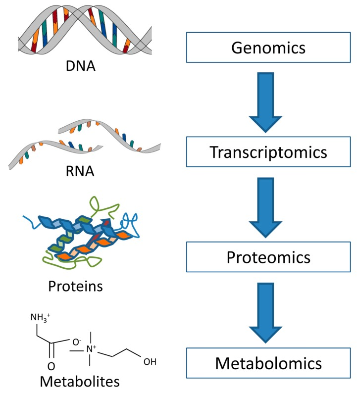
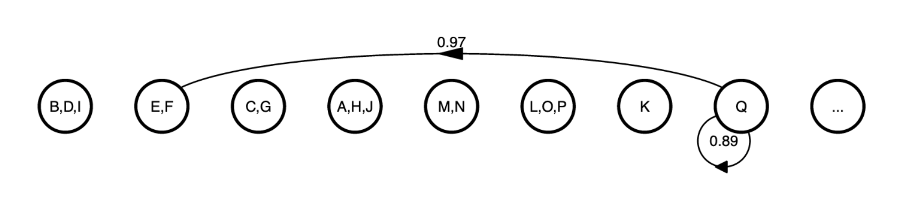
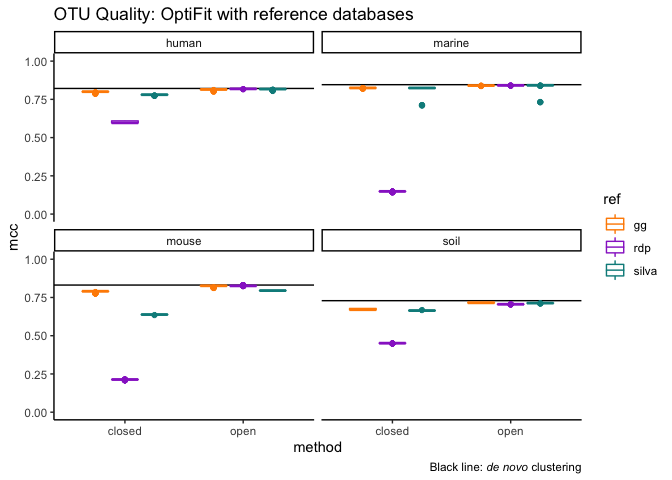
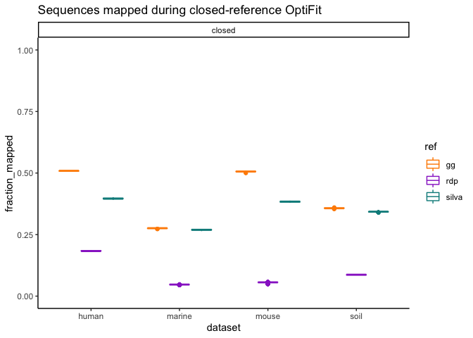
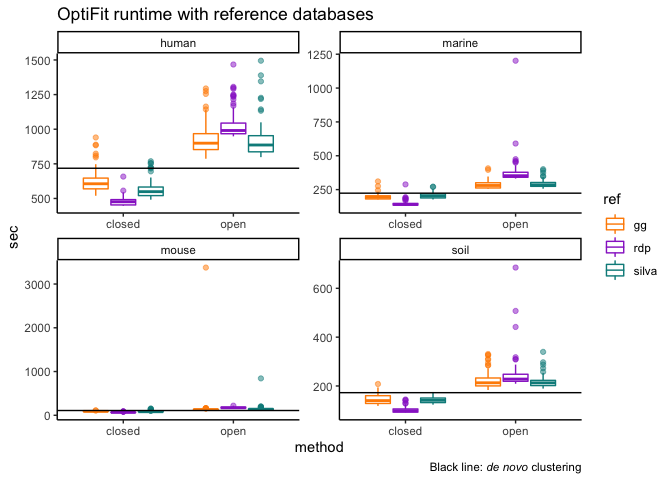
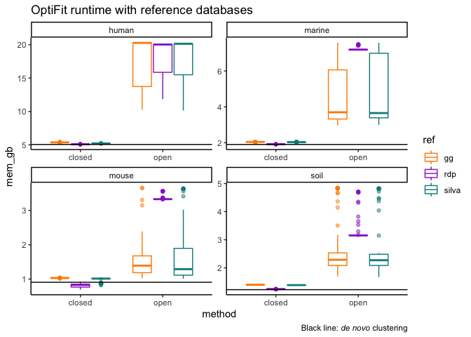
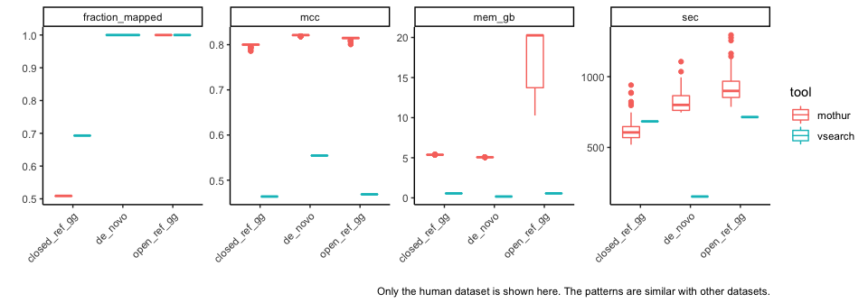
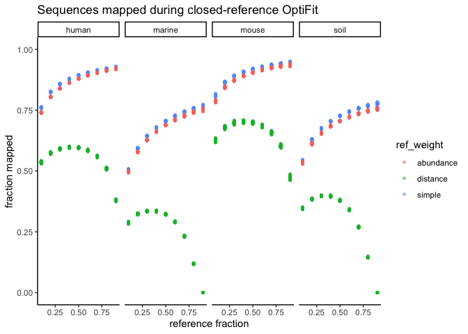
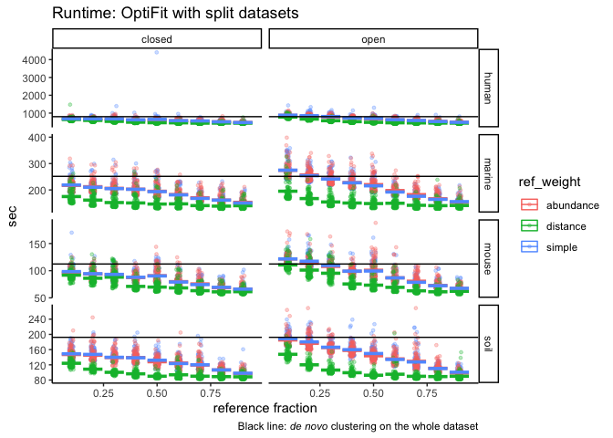
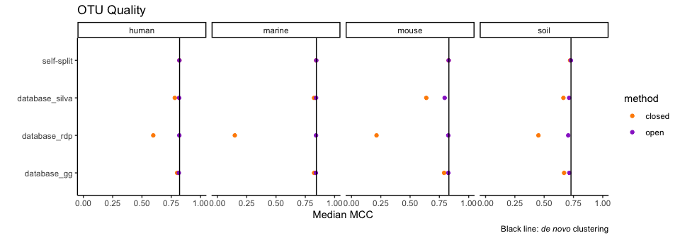

```{r setup, include=FALSE}
options(htmltools.dir.version = FALSE)
knitr::opts_chunk$set(echo = FALSE,
                      message = FALSE
                  )
# prev slides:
# - fall 2019 JC https://github.com/kelly-sovacool/bioinf603-fall2019
# - Aug 2020 prelim https://docs.google.com/presentation/d/19kXLBr-lk_3Wva_raEzOGOYW2AH-GfA2ngcSSdOFJlY/edit
# - Oct 2020 research talk https://docs.google.com/presentation/d/1GbbCYmlF4jkrO5BGyCTgtFBOL4pfzPDIQLMZBND0Hzg/edit#slide=id.p
# - Dec 2020 research talk https://github.com/SchlossLab/OptiFitAnalysis/blob/master/docs/slides/2020-12-14_lab-mtg.Rmd

```

```{r xaringan-themer, include=FALSE, warning=FALSE}
library(xaringanthemer)
style_mono_accent(
  #base_color = "#23395b",
  base_color = "#000000",
  header_font_google = google_font("Helvetica"),
  text_font_google = google_font("Helvetica")
)
```

```{r chakra, eval = FALSE}
# run once to download remark-lastest
xaringan::summon_remark(to = 'docs/slides/libs')
```


```{r libs}
library(here)
library(knitr)
library(tidyverse)
xaringanExtra::use_share_again()
```

background-image: url("../../figures/for_slides/SchlossLab.png") 
background-size: contain
background-color: "#000000"
class: inverse

???
Sarah Westcott, software engineer.
implemented algorithms I'm discussing today.

---

## Role of the microbiome in human health

.center[

]

???
Human Microbes: The Power within (2018)

[The Human Microbiome Project (2012) Nature](https://dx.doi.org/10.1038%2Fnature11234)


---

## The gut microbiome changes in colorectal cancer

.pull-left[
- Colorectal cancer patients have an altered gut microbiome compared to healthy individuals.

- Fecal matter transplants from cancerous mice increase tumor formation in germ-free mice.

- Machine learning models trained on microbiome data to predict CRC have modest performance (mean AUROC ~0.7) 
]

.pull-right[

]

.footnote[
[Zackular et al. (2013) _mBio_](doi.org/10.1128/mBio.00692-13)
]

---

## Characterizing microbial communities

.pull-left[

]

--

.pull-right[

- Genomics: Which microbes are there & what are they capable of doing

- Transcriptomics: What are they trying to do

- Proteomics: What are they actually doing

- Metabolomics: How are they affecting the host & each other

.footnote[
[Haukaas et al. (2017) _Metabolites_](doi.org/10.3390/metabo7020018)
]
]

---

## Sequencing techniques

|   | Metagenomics | Amplicon Sequencing |
|------|--------------|----------|
| **Technique** | Whole-metagenome shotgun sequencing: every gene of every microbe | Sequence just 250bp of the 16S rRNA gene |
| **Cost** | 💲💲💲 | 💲 |
| **Taxonomic resolution** | Species or strain | Genus |
| **Organisms** | Bacteria, archaea, viruses, fungi | Bacteria & archaea; or fungi separately | 
| **Purpose** | Identify which microbial genes are present; assemble microbial genomes | Identify which microbes are present and their abundances |

???
metagenomics is prohibitively expensive for very large datasets

mothur: command line program for processing amplicon sequence data and comparing microbial communities

---

## Operational Taxonomic Units (OTUs)

- Cluster similar sequences together into OTUs as a proxy for genus/species.
- OTUs clustered at 3% distance (97% sequence similarity) generally can be labelled at the genus level.

.center[

]
.pull-right[Image credit: M. Brodie Mumphrey]

---

## Why cluster sequences into OTUs?

- Bacterial taxonomy is imperfect. Some species are overly broad, others are too narrow.
  - e.g. some strains of _E. coli_ share only 20% of their genomes.
  
- Many bacteria have multiple copies of the rRNA gene.
  - Pick a sequence distance threshold to minimize splitting sequences from the same genome into different OTUs.
  
- Bacteria evolve rapidly. Don't want to exclude novel microbes from an analysis.

???

Bacterial taxonomy is hard

Goal of classification is to reflect evolutionary history.

Challenges:
- Asexual reproduction
- Fast evolutionary change
- Horizontal gene transfer

Current classifications are far from perfect.

Courtney's resolution figure?

---

## Evaluating OTU Quality

Pairs of sequences that are under the distance threshold should be assigned to the same OTU; sequences above the threshold should be assigned to different OTUs.

Confusion Matrix:

|   | Actual Positive | Actual Negative |
|---|---|---|
| Predicted Positive | TP | FP |
| Predicted Negative | FN | TP |

--

Matthews Correlation Coefficient:

$$MCC = \frac{TP \times TN - FP \times FN}{\sqrt{(TP + FP)(TP + FN)(TN + FP)(TN + FN)}}$$

Range of MCC:

- 1 - perfect prediction
- 0 - random
- -1 - completely wrong

---

## OTU Clustering methods

- _De novo_ 
  - Cluster sequences based on their similarity to each other.
  - Limitation: OTUs aren't stable; you'll get different OTU assignments when new sequences are added.
- Reference-based 
  - Cluster sequences based on their similarity to a reference database.
  - Limitation: novel sequences won't be represented. OTUs are limited by the diversity represented in the database.

.center[

]

???

_De novo_ methods out-perform reference-based methods.

.footnote[

  [Westcott & Schloss (2015) _PeerJ_ ](https://doi.org/10.7717%2Fpeerj.1487);
  [Schloss (2016) _mSystems_ ](https://doi.org/10.1128%2FmSystems.00027-16);
  [Westcott & Schloss (2017) _mSphere_](10.1128/mSphereDirect.00073-17)
]

---

## OptiClust: _de novo_ OTUs that optimize the MCC

1. Calculate all pairwise distance scores.

  .center[
```
seqA AGGGTACG
seqB ACG-TACG
```
$$distance = 1 - sequence\ similarity = 1 - \frac{number\ of\ matches}{sequence\  length}$$
]

1. Begin with each sequence assigned to its own OTU.

1. For each sequence, consider whether to move it to a different OTU or not. Do whichever option results in the best MCC score. Repeat until the MCC doesn't change.

.center[

]

.footnote[

]

???
if equally good, pick one at random.

opticlust is great, but still has limitations of _de novo_ clustering: OTU assignments aren't stable when new sequences are added.

---

## OptiFit: assign new sequences to existing OTUs

1. Start with OTUs that were previously clustered _de novo_ to use as a reference.

1. Calculate pairwise sequence distance scores between all reference and query sequences.

1. Begin with each query sequence randomly assigned to a reference OTU.

1. For each query sequence, consider whether to move it to a different OTU or not. Do whichever option results in the best MCC score. Repeat until the MCC doesn't change.

&nbsp;  
&nbsp;
&nbsp;
&nbsp;

.pull-left[

]

---

## Reference-based strategies

- Modes
  - Closed - sequences that can't be fit to the reference are thrown out.
  - Open - sequences that can't be fit to the reference are then clustered _de novo_ to create additional OTUs.
  
- Reference choice
  - External, independent database (SILVA, greengenes, RDP).
  - Split the dataset into a reference & query set.

---

## Reference clustering against a database

Questions

- Which database should we use?
  - SILVA, Greengenes, Ribosomal database project
  
- How does the performance of fitting datasets to independent databases compare to _de novo_ clustering?

- Are the results consistent across datasets from a variety of sources? 
  - Human gut, mouse gut, marine, soil
  
- How does mothur compare to vsearch?

---

## Reference clustering against a database

.pull-left[


]

--

.pull-right[


]

???
- _De novo_ and open-reference perform equally well.
- Closed reference performs slightly worse.
- RDP doesn't perform well.
- Prior to switching to silva v132 & updating mothur, closed-reference artificially outperformed open-reference.

---

## Reference clustering against a database

.pull-left[


]

--

.pull-right[


]

---


## mothur vs. vsearch




???
- Just showing the human dataset here because results patterns were basically the same across all datasets.
- Only used greengenes for reference because that's what
QIIME does.

---

## Splitting datasets into reference & query sets

Questions

- What fraction of sequences should be in the reference?

- How to select which sequences to be in the reference?
  - Simple random sample
  - Weight by sequence abundance
  - Weight by connectivity (number of pairs within the distance threshold)
  
- How does the performance of fitting datasets to reference fractions compare to de novo clustering? 

- Are the results consistent across datasets from a variety of sources?
  - Human gut, mouse gut, marine, soil

---

## Splitting datasets into reference & query sets


---

## Splitting datasets into reference & query sets



---

## Splitting datasets into reference & query sets



---

## Summarizing mothur results



???

Whenever there's virtually no variation in the metric across random seeds.

---
## Conclusions

- If you need to assign new sequences to existing OTUs, OptiFit results in OTUs of similar quality as OptiClust.

- _De novo_ clustering still usually outperforms reference clustering against an external database.

- VSEARCH runs faster but produces lower quality OTUs than OptiFit or OptiClust.

- OptiFit runs slower than OptiClust in some cases; continue using OptiClust if stable OTUs aren't required.

--

## What's next

- Demonstrate that OptiFit works well for machine learning.

- Integrate OTUs with other microbial omics data.

---

## Managing Bioinformatics Pipelines

.center[

]

.footnote[
[snakemake.readthedocs.io](https://snakemake.readthedocs.io)
]

???
I ran about 20,000 jobs on the GreatLakes HPC

---

## Pipelines with  

&nbsp;

.center[

]

.footnote[
[snakemake.readthedocs.io](https://snakemake.readthedocs.io)
]

---

## Tools for Reproducible Bioinformatics 

| package mgmt | scripts | reports | workflow | version control |
|---|---|---|---|---|
|    |  |  |  | |

--

.center[
### ...and headache prevention!
]

