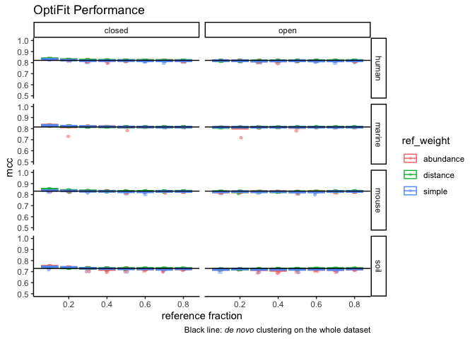
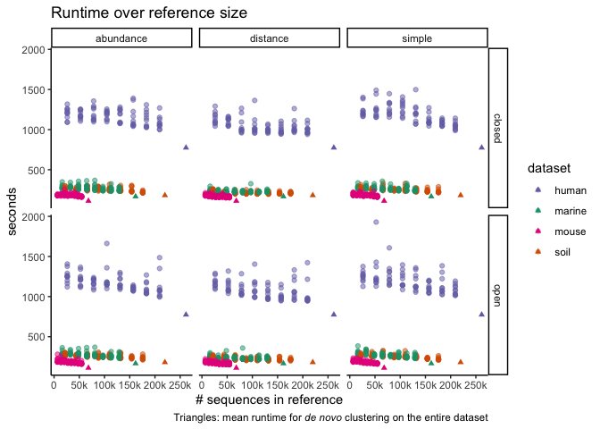
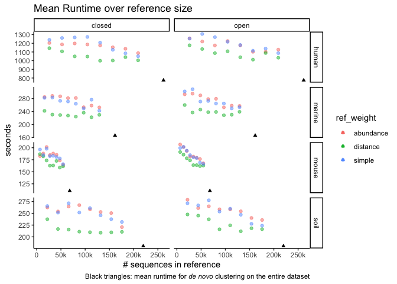
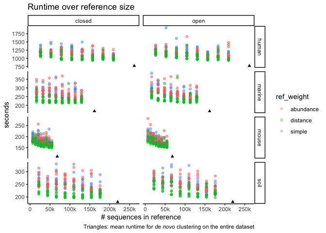
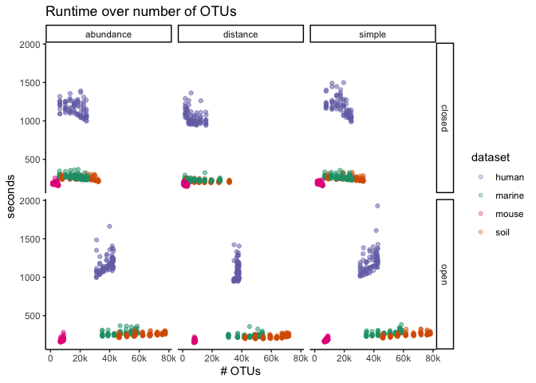

Exploratory Plots
================
Sept. 2020

``` r
library(cowplot)
library(ggtext)
library(here)
library(knitr)
library(tidyverse)
theme_set(theme_classic())
color_palette <- RColorBrewer::brewer.pal(4, "Dark2")
dataset_colors <- c(
  human = color_palette[[3]],
  marine = color_palette[[1]],
  mouse = color_palette[[4]],
  soil = color_palette[[2]]
)
full_join_files <- function(filenames) {
  filenames %>% 
  lapply(read_tsv) %>% 
  reduce(full_join)
}
set.seed(2018)
```

``` r
dat <- c('subworkflows/3_fit_sample_subset/results/all-seqs/sensspec.tsv',
         'subworkflows/3_fit_sample_subset/results/all-seqs/benchmarks.tsv',
         'subworkflows/3_fit_sample_subset/results/all-seqs/input_sizes.tsv',
         'subworkflows/3_fit_sample_subset/results/all-seqs/sensspec.tsv',
         'subworkflows/3_fit_sample_subset/results/all-seqs/fraction_reads_mapped.tsv') %>% 
  here() %>% 
  full_join_files() %>% 
  mutate(num_total_seqs = num_ref_seqs + num_sample_seqs,
         gaps_frac = n_gaps / total_chars,
         mem_mb = max_rss,
         mem_gb = mem_mb / 1024)

denovo <- c('sensspec.tsv?token=AEHR6TKSSN7MCV5HE2X7GVK7T5ZH2',
            'benchmarks.tsv?token=AEHR6TPJKCME4ZASVBZ3QYK7T5ZL6',
            'dataset_sizes.tsv?token=AEHR6TNFM52JSRD3LU45DB27T5ZN2') %>% 
  lapply(function(x) { paste0('https://raw.githubusercontent.com/SchlossLab/OptiFitAnalysis/master/subworkflows/1_prep_samples/results/', x)}) %>% 
  full_join_files() %>% 
  mutate(ref_frac = 1)

denovo_sum <- denovo %>% group_by(dataset) %>% summarize(mean_mcc=mean(mcc), 
                                                         sd_mcc=sd(mcc),
                                                         mean_sec=mean(s),
                                                         sd_sec=sd(s),
                                                         num_ref_seqs = mean(num_seqs),
                                                         mean_mem_gb=mean(max_rss/1024),
                                                         sd_mem_gb=sd(max_rss/1024))
denovo_sum
```

    ## # A tibble: 4 x 8
    ##   dataset mean_mcc    sd_mcc mean_sec sd_sec num_ref_seqs mean_mem_gb sd_mem_gb
    ##   <chr>      <dbl>     <dbl>    <dbl>  <dbl>        <dbl>       <dbl>     <dbl>
    ## 1 human      0.821 0.00123       774.   84.4       261539       5.05   0.000448
    ## 2 marine     0.815 0.0000999     166.   16.6       161561       1.34   0.000875
    ## 3 mouse      0.831 0.00103       110.   13.2        68111       0.914  0.000364
    ## 4 soil       0.729 0.00267       180.   23.4       219754       1.22   0.00158

## OptiFit performance with varied reference sizes

The query sequences are the complement of the reference sequences.
i.e. \(query\_frac = 1 - reference\_frac\)

``` r
dat %>%
  ggplot(aes(x = ref_frac, y = mcc, color = dataset)) +
  geom_jitter(size = 1, alpha = 0.3, width = 0.01) +
  stat_summary(fun = mean, geom = 'crossbar') +
  scale_color_manual(values = dataset_colors) +
  facet_grid(method ~ ref_weight) +
  labs(title='OptiFit Performance',
       x='reference fraction')
```

<!-- -->

``` r
dat %>%
  ggplot(aes(x = ref_frac, y = mcc, color = dataset)) +
  geom_jitter(size = 1, alpha = 0.3, width = 0.01) +
  stat_summary(fun = mean, geom = 'crossbar') +
  geom_hline(aes(yintercept = mean_mcc, color = dataset), denovo_sum, linetype='dashed') +
  scale_color_manual(values = dataset_colors) +
  facet_grid(method ~ ref_weight) +
  labs(title='OptiFit Performance',
       x='reference fraction',
       caption='Dashed line: _de novo_ clustering on the whole dataset.') +
  theme(plot.caption = element_markdown())
```

<!-- -->

``` r
dat %>%
  ggplot(aes(x = ref_frac, y = mcc, color = ref_weight)) +
  geom_jitter(size = 1, alpha = 0.3, width = 0.01) +
  stat_summary(fun = mean, geom = 'crossbar', alpha = 0.5) +
  geom_hline(aes(yintercept = mean_mcc), denovo_sum) +
  facet_grid(dataset ~ method, scales = 'free') +
  labs(title='OptiFit Performance',
       x='reference fraction',
       caption='Black line: _de novo_ clustering on the whole dataset') +
  theme(plot.caption = element_markdown())
```

<!-- -->

``` r
dat %>%
  ggplot(aes(x = ref_frac, y = mcc, color = ref_weight)) +
  geom_jitter(size = 1, alpha = 0.3, width = 0.01) +
  stat_summary(fun = mean, geom = 'crossbar', alpha = 0.5) +
  geom_hline(aes(yintercept = mean_mcc), denovo_sum) +
  facet_grid(dataset ~ method) +
  ylim(0.5, 1) +
  labs(title='OptiFit Performance',
       x='reference fraction',
       caption='Black line: _de novo_ clustering on the whole dataset') +
  theme(plot.caption = element_markdown())
```

<!-- -->

Closed- and open-reference clustering perform virtually the same as *de
novo* clustering.

The performance is very consistent across reference fractions when
weighting sequences by abundance or not at all (simple). When weighting
by distance, the performance decreases slightly as the reference
fraction increases. This is expected because a larger fraction means
**more** sequences with **fewer** pairwise distances under the 0.03
threshold are included in the reference.

## Runtime

``` r
dat %>% ggplot(aes(x=num_ref_seqs, y=s, color=dataset)) +
  geom_point(alpha = 0.3) +
  geom_point(aes(x=num_ref_seqs, y=mean_sec), denovo_sum, shape='triangle') +
  facet_grid(method ~ ref_weight) +
  scale_color_manual(values = dataset_colors) +
  scale_x_continuous(breaks = seq(0, 300000, 50000),
                     labels = c('0', '50k', '100k', '150k', '200k', '250k', '300k')) +
  labs(title = 'Runtime over reference size',
       x = '# sequences in reference',
       y = 'seconds',
       caption = 'Triangles: mean runtime for _de novo_ clustering on the entire dataset') +
  theme(plot.caption = element_markdown())
```

<!-- -->

``` r
dat %>% group_by(num_ref_seqs, dataset, ref_weight, method) %>% 
  summarize(mean_sec=mean(s)) %>% 
  ggplot(aes(x=num_ref_seqs, y=mean_sec, color=ref_weight)) +
  geom_point(alpha = 0.5) +
  geom_point(aes(x=num_ref_seqs, y=mean_sec, color=NULL), denovo_sum, shape='triangle') +
  facet_grid(dataset ~ method, scales = 'free') +
  scale_x_continuous(breaks = seq(0, 300000, 50000),
                     labels = c('0', '50k', '100k', '150k', '200k', '250k', '300k')) +
  labs(title = 'Mean Runtime over reference size',
       x = '# sequences in reference',
       y = 'seconds',
       caption = 'Black triangles: mean runtime for _de novo_ clustering on the entire dataset') +
  theme(plot.caption = element_markdown())
```

<!-- -->

``` r
dat %>% ggplot(aes(x=num_ref_seqs, y=s)) +
  geom_point(aes(color = ref_weight), alpha = 0.3) +
  geom_point(aes(x=num_ref_seqs, y=mean_sec), denovo_sum, shape='triangle') +
  facet_grid(dataset ~ method, scales = 'free') +
  scale_x_continuous(breaks = seq(0, 300000, 50000),
                     labels = c('0', '50k', '100k', '150k', '200k', '250k', '300k')) +
  labs(title = 'Runtime over reference size',
       x = '# sequences in reference',
       y = 'seconds',
       caption = 'Triangles: mean runtime for _de novo_ clustering on the entire dataset') +
  theme(plot.caption = element_markdown())
```

<!-- -->

``` r
dat %>%
  ggplot(aes(x=numotus, y=s, color=dataset)) +
  geom_point(alpha = 0.3) +
  facet_grid(method ~ ref_weight) +
  scale_color_manual(values = dataset_colors) +
  scale_x_continuous(breaks = seq(0, 80000, 20000),
                     labels = c('0', '20k', '40k', '60k', '80k')) +
  labs(title = 'Runtime over number of OTUs',
       x = '# OTUs',
       y = 'seconds')
```

<!-- -->

``` r
dat %>%
  ggplot(aes(x=numotus, y=s, color=ref_weight)) +
  geom_point(alpha = 0.3) +
  facet_grid(dataset ~ method, scales = 'free') +
  labs(title = 'Runtime over number of OTUs',
       x = '# OTUs',
       y = 'seconds')
```

<!-- -->

Open-reference clustering has more OTUs because it will cluster any
sequences *de novo* that do not fit into existing OTUs, while
closed-reference clustering throws them out. This plot is confounded by
the number of sequences in the reference, perhaps I should re-plot it as
the ratio of OTUs to reference sequences?

## Memory usage

``` r
dat %>% group_by(num_ref_seqs, dataset, ref_weight, method) %>% 
  summarize(mean_mem_gb=mean(mem_gb)) %>% 
  ggplot(aes(x=num_ref_seqs, y=mean_mem_gb, color=dataset)) +
  geom_point(alpha = 0.5) +
  geom_point(aes(x=num_ref_seqs, y=mean_mem_gb), denovo_sum, shape='triangle') +
  facet_grid(method ~ ref_weight) +
  scale_color_manual(values = dataset_colors) +
  scale_x_continuous(breaks = seq(0, 300000, 50000),
                     labels = c('0', '50k', '100k', '150k', '200k', '250k', '300k')) +
  labs(title = 'Memory usage over reference size',
       x = '# sequences in reference',
       y = 'GB',
       caption = 'Triangles: mean runtime for _de novo_ clustering on the entire dataset') +
  theme(plot.caption = element_markdown())
```

<!-- -->

``` r
dat %>% group_by(num_ref_seqs, dataset, ref_weight, method) %>% 
  summarize(mean_mem_gb=mean(mem_gb)) %>% 
  ggplot(aes(x=num_ref_seqs, y=mean_mem_gb, color=ref_weight)) +
  geom_point(alpha = 0.5) +
  geom_point(aes(x=num_ref_seqs, y=mean_mem_gb, color=NULL), denovo_sum, shape='triangle') +
  facet_grid(dataset ~ method, scales = 'free') +
  scale_x_continuous(breaks = seq(0, 300000, 50000),
                     labels = c('0', '50k', '100k', '150k', '200k', '250k', '300k')) +
  labs(title = 'Memory usage over reference size',
       x = '# sequences in reference',
       y = 'GB',
       caption = 'Black triangles: mean runtime for _de novo_ clustering on the entire dataset') +
  theme(plot.caption = element_markdown())
```

<!-- -->

## Fraction of sequences that map to the reference

``` r
dat %>% 
  filter(method == 'closed') %>% 
  group_by(dataset, ref_weight, ref_frac) %>% 
  ggplot(aes(x=ref_frac, y=fraction_mapped, color=dataset)) +
  geom_jitter(alpha = 0.5, width = 0.01, size=1) +
  scale_color_manual(values = dataset_colors) +
  facet_wrap("ref_weight") +
  ylim(0, 1) +
  labs(title="Sequences mapped during closed-reference OptiFit",
       x='reference fraction',
       y='fraction mapped')
```

<!-- -->

``` r
dat %>% 
  filter(method == 'closed') %>% 
  group_by(dataset, ref_weight, ref_frac) %>% 
  ggplot(aes(x=ref_frac, y=fraction_mapped, color=ref_weight)) +
  geom_jitter(alpha = 0.5, width = 0.01, size=1) +
  facet_wrap("dataset", nrow=1) +
  ylim(0, 1) +
  labs(title="Sequences mapped during closed-reference OptiFit",
       x='reference fraction',
       y='fraction mapped')
```

<!-- -->

The fraction of sequences that are able to be fit to the reference in
closed-reference clustering increases as the reference size increases
when weighting sequences by abundance or by a simple random sample. It’s
also remarkably stable between abundance & simple weighting, and between
all seeds. Weighting by distance performs poorly, likely because the top
n sequences with the most pairwise similarities are included in the
reference, leaving sequences with few similarities to then be fit to the
highly-connected reference.
