Nov. - Dec. 2020

``` r
set.seed(2018)
library(cowplot)
library(ggtext)
library(glue)
library(here)
library(knitr)
library(tidyverse)

theme_set(theme_classic())
color_palette <- RColorBrewer::brewer.pal(4, "Dark2")
dataset_colors <- c(
  human = color_palette[[3]],
  marine = color_palette[[1]],
  mouse = color_palette[[4]],
  soil = color_palette[[2]]
)

mutate_perf <- function(dat) {
  dat %>% 
    mutate(mem_mb = max_rss,
           mem_gb = mem_mb / 1024) %>% 
    rename(sec = s,
           num_otus = sobs)
}
```

## *de novo* clustering

``` r
opticlust <- read_tsv(here('subworkflows/1_prep_samples/results/opticlust_results.tsv')) %>% 
  full_join(read_tsv(here('subworkflows/1_prep_samples/results/dataset_sizes.tsv'))) %>% 
  mutate_perf()
sum_opticlust <- opticlust %>% 
  group_by(dataset) %>% 
  summarize(mean_mcc = mean(mcc),
            sd_mcc = sd(mcc),
            mean_sec = mean(sec),
            sd_sec = sd(sec),
            mean_npshannon = mean(npshannon))
```

``` r
opticlust %>% 
  ggplot(aes(dataset, mcc)) +
  geom_jitter(alpha = 0.5) +
  ylim(0.5, 1)
```

<!-- -->

``` r
opticlust %>% 
  ggplot(aes(num_seqs, sec, color = dataset)) +
  geom_point(alpha = 0.5)
```

<!-- --> \#\# fit to reference
databases

``` r
ref_sizes <- read_tsv(here('subworkflows/2_fit_reference_db/results/ref_sizes.tsv'))
optifit_dbs <- read_tsv(here('subworkflows/2_fit_reference_db/results/optifit_dbs_results.tsv')) %>% 
  mutate_perf()
head(optifit_dbs)
```

    ## # A tibble: 6 x 46
    ##   label...1 cutoff numotus     tp      tn     fp     fn sensitivity specificity
    ##       <dbl>  <dbl>   <dbl>  <dbl>   <dbl>  <dbl>  <dbl>       <dbl>       <dbl>
    ## 1      0.03   0.03   35104 4.14e7 3.23e10 6.16e6 1.39e7       0.748        1.00
    ## 2      0.03   0.03   35084 4.22e7 3.23e10 6.37e6 1.31e7       0.763        1.00
    ## 3      0.03   0.03   35116 4.22e7 3.23e10 6.37e6 1.31e7       0.762        1.00
    ## 4      0.03   0.03   35075 4.22e7 3.23e10 6.39e6 1.31e7       0.763        1.00
    ## 5      0.03   0.03   34653 4.21e7 3.23e10 6.33e6 1.33e7       0.76         1.00
    ## 6      0.03   0.03   35119 4.22e7 3.23e10 6.40e6 1.31e7       0.763        1.00
    ## # … with 37 more variables: ppv <dbl>, npv <dbl>, fdr <dbl>, accuracy <dbl>,
    ## #   mcc <dbl>, f1score <dbl>, sec <dbl>, `h:m:s` <time>, max_rss <dbl>,
    ## #   max_vms <dbl>, max_uss <dbl>, max_pss <dbl>, io_in <dbl>, io_out <dbl>,
    ## #   mean_load <dbl>, label...25 <dbl>, group <lgl>, nseqs <dbl>,
    ## #   num_otus <dbl>, npshannon <dbl>, invsimpson <dbl>, invsimpson_lci <dbl>,
    ## #   invsimpson_hci <dbl>, dataset <chr>, ref <chr>, region <chr>, seed <dbl>,
    ## #   method <chr>, printref <lgl>, fraction_mapped <dbl>, ref_weight <lgl>,
    ## #   ref_frac <lgl>, sample_frac <lgl>, tool <chr>, label...24 <dbl>,
    ## #   mem_mb <dbl>, mem_gb <dbl>

``` r
optifit_dbs %>% 
  ggplot(aes(x=method, y=mcc, color=ref)) +
  geom_hline(aes(yintercept = mean_mcc), sum_opticlust) +
  geom_jitter(alpha = 0.5) + 
  facet_wrap('dataset') +
  ylim(0, 1) +
  labs(title='OTU Quality: OptiFit with reference databases',
       caption='Black line: _de novo_ clustering') +
  theme(plot.caption = element_markdown())
```

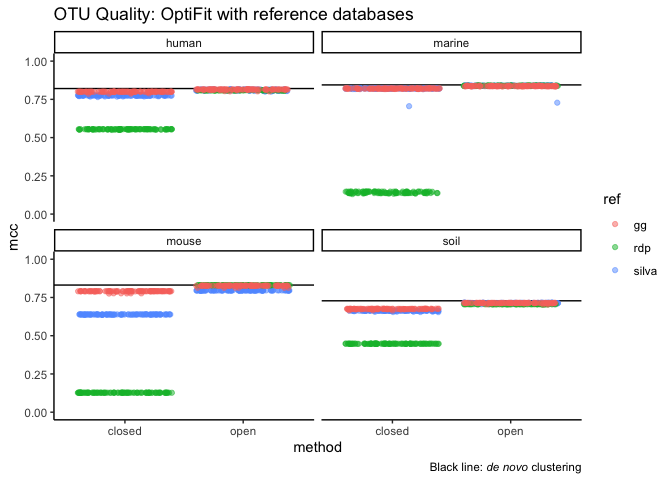<!-- -->

``` r
optifit_dbs %>% filter(method == 'closed') %>% 
  ggplot(aes(x=dataset, y=fraction_mapped, color=ref)) +
  geom_jitter(alpha = 0.5) + 
  ylim(0, 1) +
  labs(title="Sequences mapped during closed-reference OptiFit") +
  theme(plot.caption = element_markdown())
```

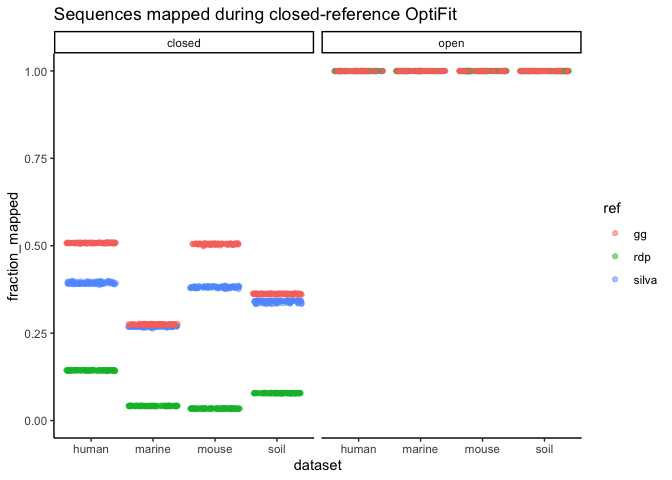<!-- -->

``` r
optifit_dbs %>% 
  ggplot(aes(x=method, y=sec, color=ref)) +
  geom_jitter(alpha = 0.5) +
  geom_hline(aes(yintercept = mean_sec), sum_opticlust) +
  facet_wrap('dataset', scales = 'free') +
  labs(title='OptiFit runtime with reference databases',
       caption='Black line: _de novo_ clustering') +
  theme(plot.caption = element_markdown())
```

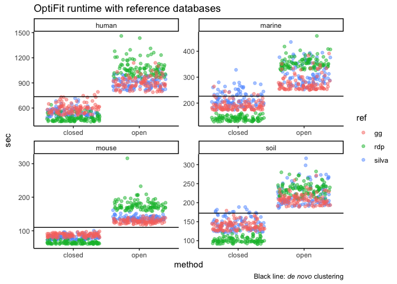<!-- -->

``` r
optifit_dbs %>% 
  ggplot(aes(x=method, y=npshannon, color=ref)) +
  geom_jitter(alpha = 0.5) +
  geom_hline(aes(yintercept = mean_npshannon), sum_opticlust) +
  facet_wrap('dataset', scales = 'free') +
  labs(title='OptiFit runtime with reference databases',
       caption='Black line: _de novo_ clustering') +
  theme(plot.caption = element_markdown())
```

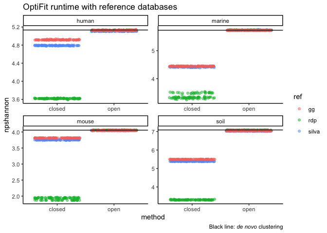<!-- -->

## fit split datasets

``` r
optifit_split <- read_tsv(here('subworkflows/3_fit_sample_split/results/optifit_split_results.tsv')) %>% 
  mutate_perf()
```

``` r
optifit_split %>% 
  ggplot(aes(x = ref_frac, y = mcc, color = ref_weight)) +
  geom_jitter(size = 1, alpha = 0.3, width = 0.01) +
  stat_summary(fun = mean, geom = 'crossbar', alpha = 0.5) +
  geom_hline(aes(yintercept = mean_mcc), sum_opticlust) +
  facet_grid(dataset ~ method) +
  ylim(0, 1) +
  labs(title='OTU Quality: OptiFit with split datasets',
       x='reference fraction',
       caption='Black line: _de novo_ clustering on the whole dataset') +
  theme(plot.caption = element_markdown())
```

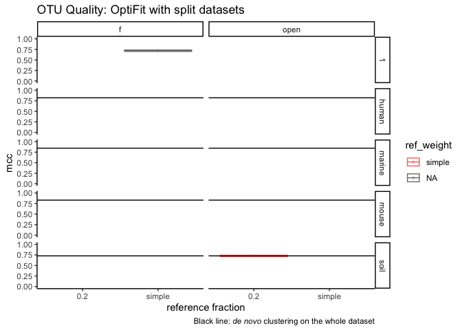<!-- -->

``` r
optifit_split %>% 
  ggplot(aes(x = ref_frac, y = sec, color = ref_weight)) +
  geom_jitter(size = 1, alpha = 0.3, width = 0.01) +
  stat_summary(fun = mean, geom = 'crossbar', alpha = 0.5) +
  geom_hline(aes(yintercept = mean_sec), sum_opticlust) +
  facet_grid(dataset ~ method, scales = 'free') +
  labs(title='Runtime: OptiFit with split datasets',
       x='reference fraction',
       caption='Black line: _de novo_ clustering on the whole dataset') +
  theme(plot.caption = element_markdown())
```

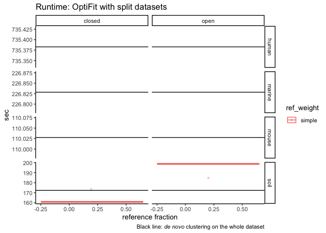<!-- -->

### fraction mapped

``` r
optifit_split %>% 
  filter(method == 'closed', tool == 'mothur', is.na(ref)) %>% 
  #group_by(dataset, ref_weight, ref_frac) %>% 
  ggplot(aes(x=ref_frac, y=fraction_mapped, color=ref_weight)) +
  geom_jitter(alpha = 0.5, width = 0.01, size=1) +
  facet_wrap("dataset", nrow=1) +
  ylim(0, 1) +
  labs(title="Sequences mapped during closed-reference OptiFit",
       x='reference fraction',
       y='fraction mapped')
```

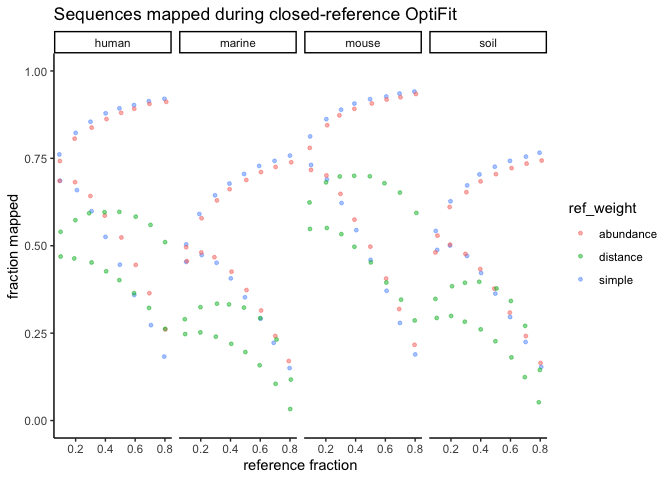<!-- -->

It looks like one result per parameter set is left over from before I
re-ran everything after revering to the older silva version. [Here’s
what the plot looked like with the newest (buggy)
silva](https://github.com/SchlossLab/OptiFitAnalysis/blob/master/exploratory/2020-05/sub3_fit_all-seqs.md#fraction-of-sequences-that-map-to-the-reference).
Need to go back and figure out why those files didn’t get
removed/overwritten by Snakemake when I re-ran everything.

``` r
optifit_split %>% 
  ggplot(aes(x = ref_frac, y = npshannon, color = ref_weight)) +
  geom_jitter(size = 1, alpha = 0.3, width = 0.01) +
  stat_summary(fun = mean, geom = 'crossbar', alpha = 0.5) +
  geom_hline(aes(yintercept = mean_npshannon), sum_opticlust) +
  facet_grid(dataset ~ method, scales = 'free') +
  labs(title='Diversity: OptiFit with split datasets',
       x='reference fraction',
       caption='Black line: _de novo_ clustering on the whole dataset') +
  theme(plot.caption = element_markdown())
```

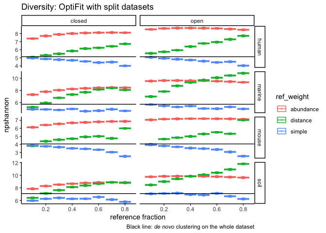<!-- -->

## vsearch

For reference-based clustering, datasets were fit to the greengenes
database.

``` r
vsearch <- read_tsv(here('subworkflows/4_vsearch/results/vsearch_results.tsv')) %>% 
  mutate_perf() %>% 
  full_join(opticlust) %>% 
  full_join(optifit_dbs %>% filter(ref == 'gg'))
```

``` r
vsearch %>% 
  ggplot(aes(x = method, y = mcc, color = tool)) +
  geom_boxplot() +
  facet_wrap('dataset') +
  ylim(0, 1) + 
  labs(x = '')
```

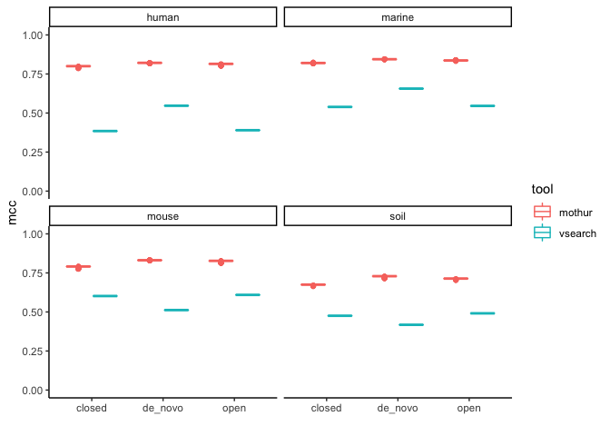<!-- -->

``` r
vsearch %>% 
  ggplot(aes(x = method, y = sec, color = tool)) +
  geom_boxplot() +
  facet_wrap('dataset') +
  labs(x = '')
```

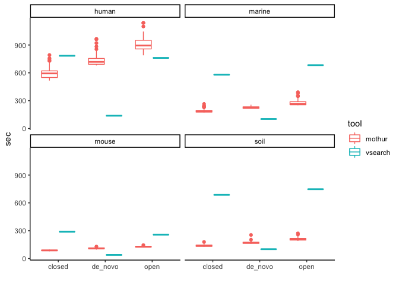<!-- -->

``` r
vsearch %>% 
  ggplot(aes(x = method, y = npshannon, color = tool)) +
  geom_boxplot() +
  facet_wrap('dataset') +
  labs(x = '')
```

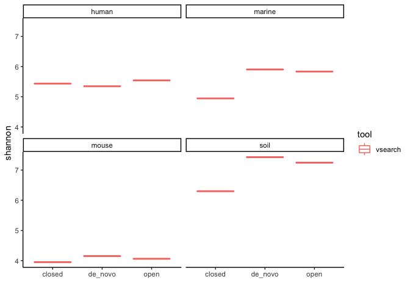<!-- -->

``` r
vsearch %>% filter(method == 'closed') %>% 
  ggplot(aes(x = dataset, y = fraction_mapped, color = tool)) +
  geom_boxplot() + 
  ylim(0, 1) +
  labs(title="Sequences mapped during closed-reference OptiFit") +
  theme(plot.caption = element_markdown())
```

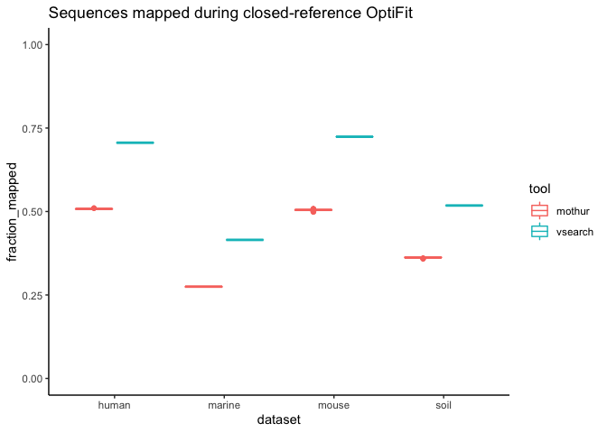<!-- -->
