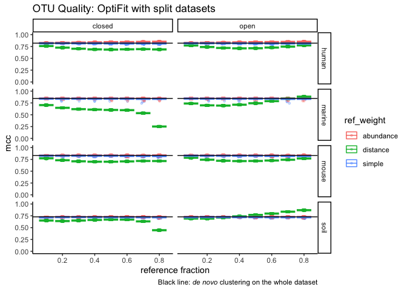
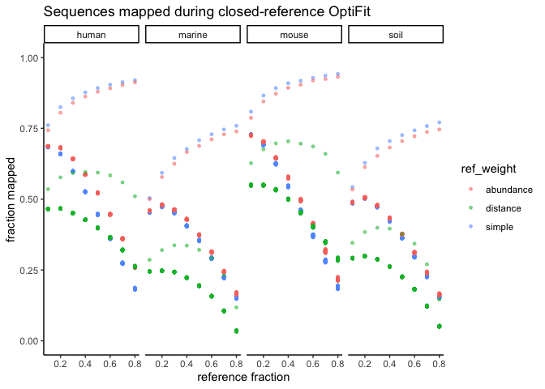
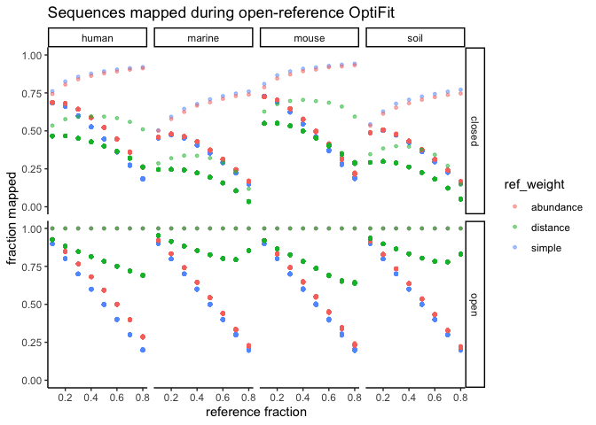

Nov. - Dec. 2020

``` r
set.seed(2018)
library(cowplot)
library(ggtext)
library(glue)
library(here)
library(knitr)
library(tidyverse)

theme_set(theme_classic())
color_palette <- RColorBrewer::brewer.pal(4, "Dark2")
dataset_colors <- c(
  human = color_palette[[3]],
  marine = color_palette[[1]],
  mouse = color_palette[[4]],
  soil = color_palette[[2]]
)
tri_colors <-  c("darkorange","darkorchid","cyan4") # https://allisonhorst.github.io/palmerpenguins/articles/intro.html
mutate_perf <- function(dat) {
  dat %>% 
    mutate(mem_mb = max_rss,
           mem_gb = mem_mb / 1024) %>% 
    rename(sec = s,
           num_otus = sobs)
}
```

## *de novo* clustering

``` r
opticlust <- read_tsv(here('subworkflows/1_prep_samples/results/opticlust_results.tsv')) %>% 
  full_join(read_tsv(here('subworkflows/1_prep_samples/results/dataset_sizes.tsv'))) %>% 
  mutate_perf()
sum_opticlust <- opticlust %>% 
  group_by(dataset) %>% 
  summarize(mean_mcc = mean(mcc),
            sd_mcc = sd(mcc),
            mean_sec = mean(sec),
            sd_sec = sd(sec),
            mean_mem_gb = mean(mem_gb))#,
            #mean_shannon = mean(shannon))
```

## fit to reference databases

``` r
ref_sizes <- read_tsv(here('subworkflows/2_fit_reference_db/results/ref_sizes.tsv'))
optifit_dbs <- read_tsv(here('subworkflows/2_fit_reference_db/results/optifit_dbs_results.tsv')) %>% 
  mutate_perf()
head(optifit_dbs)
```

    ## # A tibble: 6 x 47
    ##   label...1 cutoff numotus     tp      tn     fp     fn sensitivity specificity
    ##       <dbl>  <dbl>   <dbl>  <dbl>   <dbl>  <dbl>  <dbl>       <dbl>       <dbl>
    ## 1      0.03   0.03   35119 4.15e7 3.23e10 6.15e6 1.38e7       0.750        1.00
    ## 2      0.03   0.03   34648 4.24e7 3.23e10 6.44e6 1.30e7       0.765        1.00
    ## 3      0.03   0.03   35060 4.22e7 3.23e10 6.30e6 1.32e7       0.762        1.00
    ## 4      0.03   0.03   35065 4.24e7 3.23e10 6.43e6 1.30e7       0.765        1.00
    ## 5      0.03   0.03   34570 4.23e7 3.23e10 7.34e6 1.30e7       0.764        1.00
    ## 6      0.03   0.03   35048 4.23e7 3.23e10 6.37e6 1.30e7       0.764        1.00
    ## # … with 38 more variables: ppv <dbl>, npv <dbl>, fdr <dbl>, accuracy <dbl>,
    ## #   mcc <dbl>, f1score <dbl>, sec <dbl>, `h:m:s` <time>, max_rss <dbl>,
    ## #   max_vms <dbl>, max_uss <dbl>, max_pss <dbl>, io_in <dbl>, io_out <dbl>,
    ## #   mean_load <dbl>, label...25 <dbl>, group <lgl>, nseqs <dbl>,
    ## #   num_otus <dbl>, shannon <dbl>, shannon_lci <dbl>, shannon_hci <dbl>,
    ## #   invsimpson <dbl>, invsimpson_lci <dbl>, invsimpson_hci <dbl>,
    ## #   dataset <chr>, ref <chr>, region <chr>, seed <dbl>, method <chr>,
    ## #   printref <lgl>, fraction_mapped <dbl>, ref_weight <lgl>, ref_frac <lgl>,
    ## #   sample_frac <lgl>, tool <chr>, mem_mb <dbl>, mem_gb <dbl>

Plotted the fraction mapped for open-reference clustering too as a
sanity check. Final plots to be included in the paper won’t include
open-ref.

``` r
optifit_dbs %>% #filter(method == 'closed') %>% 
  ggplot(aes(x=dataset, y=fraction_mapped, color=ref)) +
  geom_boxplot() + 
  facet_wrap('method') +
  ylim(0, 1) +
  scale_color_manual(values=tri_colors) +
  labs(title="Sequences mapped during closed-reference OptiFit") +
  theme(plot.caption = element_markdown())
```

<!-- -->

## fit split datasets

Using buggy data from commit `824c1306eb464349f9d331f85550d539f8c66c63`.

``` bash
wget https://raw.githubusercontent.com/SchlossLab/OptiFitAnalysis/824c1306eb464349f9d331f85550d539f8c66c63/subworkflows/3_fit_sample_split/results/optifit_split_results.tsv?token=AEHR6TKMLXIG57IGER2VXSS74C5WC -O exploratory/2020-11_Nov-Dec/debug-split_100-seeds.tsv
```

``` r
optifit_split <- read_tsv(here('exploratory',
                               '2020-11_Nov-Dec',
                               'debug-split_100-seeds.tsv')) %>% 
  mutate_perf()
```

``` r
optifit_split %>% 
  ggplot(aes(x = ref_frac, y = mcc, color = ref_weight)) +
  geom_jitter(size = 1, alpha = 0.3, width = 0.01) +
  stat_summary(fun = mean, geom = 'crossbar', alpha = 0.5) +
  geom_hline(aes(yintercept = mean_mcc), sum_opticlust) +
  facet_grid(dataset ~ method) +
  ylim(0, 1) +
  labs(title='OTU Quality: OptiFit with split datasets',
       x='reference fraction',
       caption='Black line: _de novo_ clustering on the whole dataset') +
  theme(plot.caption = element_markdown())
```

<!-- -->

### fraction mapped

``` r
optifit_split %>% 
  filter(method == 'closed', tool == 'mothur', is.na(ref)) %>% 
  #group_by(dataset, ref_weight, ref_frac) %>% 
  ggplot(aes(x=ref_frac, y=fraction_mapped, color=ref_weight)) +
  geom_point(alpha = 0.5, size=1) +
  facet_wrap("dataset", nrow=1) +
  ylim(0, 1) +
  labs(title="Sequences mapped during closed-reference OptiFit",
       x='reference fraction',
       y='fraction mapped')
```

<!-- -->

It looks like one result per parameter set is left over from before I
re-ran everything after reverting to the older silva version. [Here’s
what the plot looked like with the newest (buggy)
silva](https://github.com/SchlossLab/OptiFitAnalysis/blob/master/exploratory/2020-05/sub3_fit_all-seqs.md#fraction-of-sequences-that-map-to-the-reference).
Need to go back and figure out why those files didn’t get
removed/overwritten by Snakemake when I re-ran everything.

Let’s try a sanity check with open-reference – should all be 1.

``` r
optifit_split %>% 
  filter(tool == 'mothur', is.na(ref)) %>% 
  #filter(dataset == 'soil') %>% 
  ggplot(aes(x=ref_frac, y=fraction_mapped, color=ref_weight)) +
  geom_point(alpha = 0.5, size=1) +
  facet_grid(method ~ dataset) +
  ylim(0, 1) +
  labs(title="Sequences mapped during open-reference OptiFit",
       x='reference fraction',
       y='fraction mapped')
```

<!-- -->

Did mothur’s list file format change in the latest dev version? The
fraction mapped values are the same as the reference fraction when the
ref weight is simple.

### is there a pattern?

``` r
debug_dat <- optifit_split %>% 
  filter(method == 'open') %>% 
  mutate(is_correct = fraction_mapped == 1) %>% 
  select(dataset, seed, method, fraction_mapped, is_correct, 
         sample_frac, ref_frac, ref_weight)

debug_dat %>% filter(is_correct)
```

    ## # A tibble: 96 x 8
    ##    dataset  seed method fraction_mapped is_correct sample_frac ref_frac
    ##    <chr>   <dbl> <chr>            <dbl> <lgl>            <dbl>    <dbl>
    ##  1 human      35 open                 1 TRUE               0.9      0.1
    ##  2 human      51 open                 1 TRUE               0.8      0.2
    ##  3 human      92 open                 1 TRUE               0.7      0.3
    ##  4 human      92 open                 1 TRUE               0.6      0.4
    ##  5 human      92 open                 1 TRUE               0.5      0.5
    ##  6 human      92 open                 1 TRUE               0.4      0.6
    ##  7 human       3 open                 1 TRUE               0.3      0.7
    ##  8 human      54 open                 1 TRUE               0.2      0.8
    ##  9 human      79 open                 1 TRUE               0.9      0.1
    ## 10 human     100 open                 1 TRUE               0.8      0.2
    ## # … with 86 more rows, and 1 more variable: ref_weight <chr>

Can’t discern any pattern…

## smaller dataset

Using buggy data from commit `1de7b839eae9b222b66f15dd24b0bb54a8a35459`.

``` bash
wget https://raw.githubusercontent.com/SchlossLab/OptiFitAnalysis/1de7b839eae9b222b66f15dd24b0bb54a8a35459/subworkflows/3_fit_sample_split/results/optifit_split_results.tsv?token=AEHR6TJQFZT4XT6XIYWOKNS74C7ME -O exploratory/2020-11_Nov-Dec/debug-split_2-seeds.tsv
```

``` r
split_2 <- read_tsv(here('exploratory',
                          '2020-11_Nov-Dec',
                          'debug-split_2-seeds.tsv')) %>%
  mutate_perf() %>% 
  filter(method == 'open') %>% 
  mutate(is_correct = fraction_mapped == 1) %>% 
  select(dataset, seed, method, fraction_mapped, is_correct, 
         sample_frac, ref_frac, ref_weight)

split_2 %>% 
  filter(dataset == 'soil', ref_weight == 'simple') %>% 
  select(sample_frac, ref_frac, seed, is_correct) %>% 
  pivot_wider(names_from = seed, 
              values_from = is_correct,
              names_glue = 'seed_{seed}_is_correct')
```

    ## # A tibble: 8 x 4
    ##   sample_frac ref_frac seed_1_is_correct seed_2_is_correct
    ##         <dbl>    <dbl> <lgl>             <lgl>            
    ## 1         0.9      0.1 TRUE              FALSE            
    ## 2         0.8      0.2 FALSE             TRUE             
    ## 3         0.7      0.3 TRUE              FALSE            
    ## 4         0.6      0.4 FALSE             TRUE             
    ## 5         0.5      0.5 TRUE              FALSE            
    ## 6         0.4      0.6 TRUE              FALSE            
    ## 7         0.3      0.7 TRUE              FALSE            
    ## 8         0.2      0.8 TRUE              FALSE

The pattern of correctness among ref fracs is flipped between seed 1 and
2

Whenever the fit seed matches the best cluster seed, the fraction mapped
results are correct. The bug disappears if you only use 1 seed, because
then all fit runs will use the same seed as the data split.
