Nov. - Dec. 2020

``` r
set.seed(2018)
library(cowplot)
library(ggtext)
library(glue)
library(here)
library(knitr)
library(tidyverse)

theme_set(theme_classic())
color_palette <- RColorBrewer::brewer.pal(4, "Dark2")
dataset_colors <- c(
  human = color_palette[[3]],
  marine = color_palette[[1]],
  mouse = color_palette[[4]],
  soil = color_palette[[2]]
)
tri_colors <-  c("darkorange","darkorchid","cyan4") # https://allisonhorst.github.io/palmerpenguins/articles/intro.html
mutate_perf <- function(dat) {
  dat %>% 
    mutate(mem_mb = max_rss,
           mem_gb = mem_mb / 1024) %>% 
    rename(sec = s,
           num_otus = sobs)
}
```

## *de novo* clustering

``` r
opticlust <- read_tsv(here('subworkflows/1_prep_samples/results/opticlust_results.tsv')) %>% 
  full_join(read_tsv(here('subworkflows/1_prep_samples/results/dataset_sizes.tsv'))) %>% 
  mutate_perf()
sum_opticlust <- opticlust %>% 
  group_by(dataset) %>% 
  summarize(mean_mcc = mean(mcc),
            sd_mcc = sd(mcc),
            mean_sec = mean(sec),
            sd_sec = sd(sec))#,
            #mean_shannon = mean(shannon))
```

``` r
opticlust %>% 
  ggplot(aes(dataset, mcc)) +
  geom_jitter(alpha = 0.5) +
  ylim(0.5, 1)
```

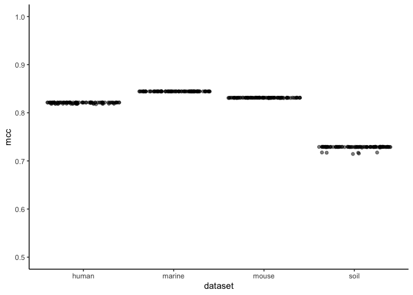<!-- -->

``` r
opticlust %>% 
  ggplot(aes(num_seqs, sec, color = dataset)) +
  geom_point(alpha = 0.5)
```

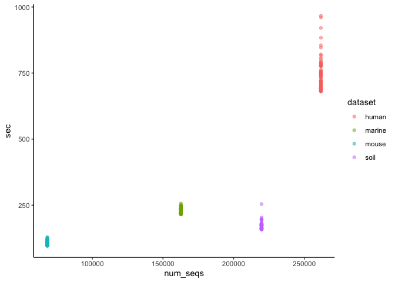<!-- --> \#\# fit to reference
databases

``` r
ref_sizes <- read_tsv(here('subworkflows/2_fit_reference_db/results/ref_sizes.tsv'))
optifit_dbs <- read_tsv(here('subworkflows/2_fit_reference_db/results/optifit_dbs_results.tsv')) %>% 
  mutate_perf()
head(optifit_dbs)
```

    ## # A tibble: 6 x 47
    ##   label...1 cutoff numotus     tp      tn     fp     fn sensitivity specificity
    ##       <dbl>  <dbl>   <dbl>  <dbl>   <dbl>  <dbl>  <dbl>       <dbl>       <dbl>
    ## 1      0.03   0.03   35119 4.15e7 3.23e10 6.15e6 1.38e7       0.750        1.00
    ## 2      0.03   0.03   34648 4.24e7 3.23e10 6.44e6 1.30e7       0.765        1.00
    ## 3      0.03   0.03   35060 4.22e7 3.23e10 6.30e6 1.32e7       0.762        1.00
    ## 4      0.03   0.03   35065 4.24e7 3.23e10 6.43e6 1.30e7       0.765        1.00
    ## 5      0.03   0.03   34570 4.23e7 3.23e10 7.34e6 1.30e7       0.764        1.00
    ## 6      0.03   0.03   35048 4.23e7 3.23e10 6.37e6 1.30e7       0.764        1.00
    ## # … with 38 more variables: ppv <dbl>, npv <dbl>, fdr <dbl>, accuracy <dbl>,
    ## #   mcc <dbl>, f1score <dbl>, sec <dbl>, `h:m:s` <time>, max_rss <dbl>,
    ## #   max_vms <dbl>, max_uss <dbl>, max_pss <dbl>, io_in <dbl>, io_out <dbl>,
    ## #   mean_load <dbl>, label...25 <dbl>, group <lgl>, nseqs <dbl>,
    ## #   num_otus <dbl>, shannon <dbl>, shannon_lci <dbl>, shannon_hci <dbl>,
    ## #   invsimpson <dbl>, invsimpson_lci <dbl>, invsimpson_hci <dbl>,
    ## #   dataset <chr>, ref <chr>, region <chr>, seed <dbl>, method <chr>,
    ## #   printref <lgl>, fraction_mapped <dbl>, ref_weight <lgl>, ref_frac <lgl>,
    ## #   sample_frac <lgl>, tool <chr>, mem_mb <dbl>, mem_gb <dbl>

``` r
optifit_dbs %>% 
  ggplot(aes(x=method, y=mcc, color=ref)) +
  geom_hline(aes(yintercept = mean_mcc), sum_opticlust) +
  geom_boxplot() + 
  facet_wrap('dataset') +
  scale_color_manual(values=tri_colors) +
  ylim(0, 1) +
  labs(title='OTU Quality: OptiFit with reference databases',
       caption='Black line: _de novo_ clustering') +
  theme(plot.caption = element_markdown())
```

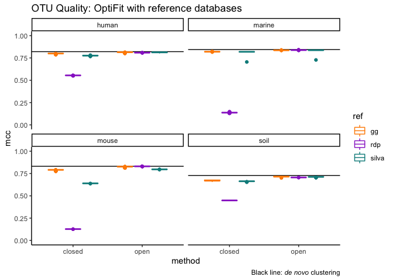<!-- -->

``` r
optifit_dbs %>% filter(method == 'closed') %>% 
  ggplot(aes(x=dataset, y=fraction_mapped, color=ref)) +
  geom_boxplot() + 
  facet_wrap('method') +
  ylim(0, 1) +
  labs(title="Sequences mapped during closed-reference OptiFit") +
  theme(plot.caption = element_markdown())
```

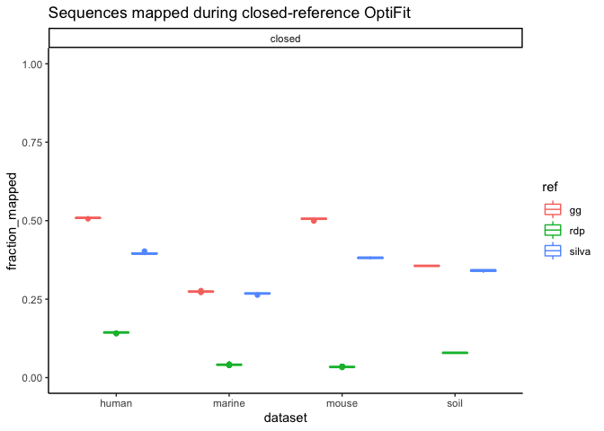<!-- -->

Plotted the fraction mapped for open-reference clustering too as a
sanity check. Final plots to be included in the paper won’t include
open-ref.

``` r
optifit_dbs %>% 
  ggplot(aes(x=method, y=sec, color=ref)) +
  geom_boxplot(alpha = 0.5) +
  geom_hline(aes(yintercept = mean_sec), sum_opticlust) +
  facet_wrap('dataset', scales = 'free') +
  labs(title='OptiFit runtime with reference databases',
       caption='Black line: _de novo_ clustering') +
  theme(plot.caption = element_markdown())
```

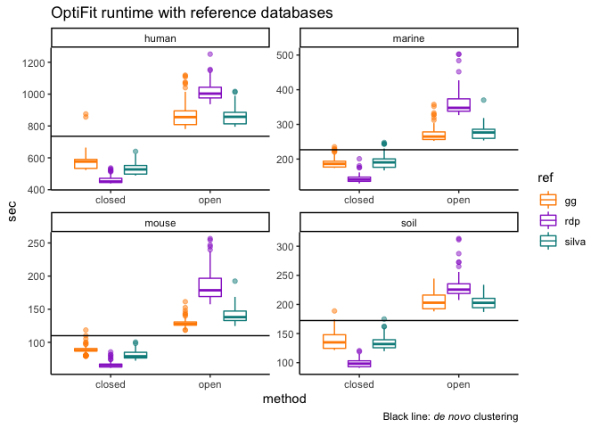<!-- -->

``` r
optifit_dbs %>% 
  ggplot(aes(x=method, y=shannon, color=ref)) +
  geom_jitter(alpha = 0.5) +
  geom_hline(aes(yintercept = mean_shannon), sum_opticlust) +
  facet_wrap('dataset', scales = 'free') +
  labs(title='OptiFit runtime with reference databases',
       caption='Black line: _de novo_ clustering') +
  theme(plot.caption = element_markdown())
```

## fit split datasets

``` r
optifit_split <- read_tsv(here('subworkflows/3_fit_sample_split/results/optifit_split_results.tsv')) %>% 
  mutate_perf()
```

``` r
optifit_split %>% 
  ggplot(aes(x = ref_frac, y = mcc, color = ref_weight)) +
  geom_jitter(size = 1, alpha = 0.3, width = 0.01) +
  stat_summary(fun = mean, geom = 'crossbar', alpha = 0.5) +
  geom_hline(aes(yintercept = mean_mcc), sum_opticlust) +
  facet_grid(dataset ~ method) +
  ylim(0, 1) +
  labs(title='OTU Quality: OptiFit with split datasets',
       x='reference fraction',
       caption='Black line: _de novo_ clustering on the whole dataset') +
  theme(plot.caption = element_markdown())
```

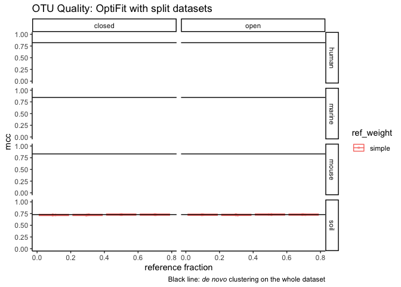<!-- -->

``` r
optifit_split %>% 
  ggplot(aes(x = ref_frac, y = sec, color = ref_weight)) +
  geom_jitter(size = 1, alpha = 0.3, width = 0.01) +
  stat_summary(fun = mean, geom = 'crossbar', alpha = 0.5) +
  geom_hline(aes(yintercept = mean_sec), sum_opticlust) +
  facet_grid(dataset ~ method, scales = 'free') +
  labs(title='Runtime: OptiFit with split datasets',
       x='reference fraction',
       caption='Black line: _de novo_ clustering on the whole dataset') +
  theme(plot.caption = element_markdown())
```

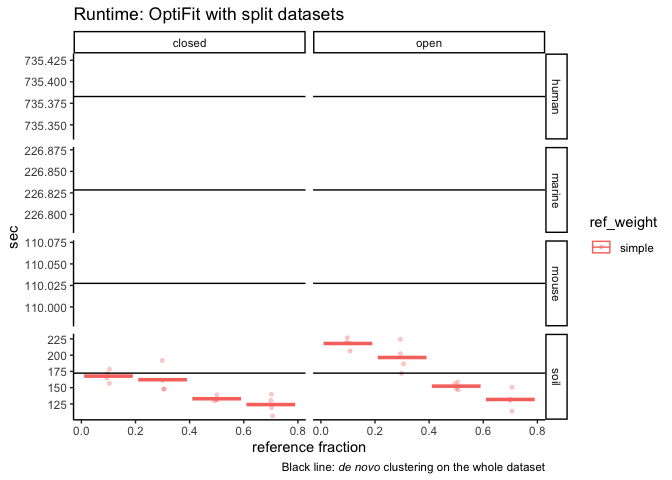<!-- -->

### fraction mapped

``` r
optifit_split %>% 
  filter(method == 'closed', tool == 'mothur', is.na(ref)) %>% 
  #group_by(dataset, ref_weight, ref_frac) %>% 
  ggplot(aes(x=ref_frac, y=fraction_mapped, color=ref_weight)) +
  geom_point(alpha = 0.5, size=1) +
  facet_wrap("dataset", nrow=1) +
  ylim(0, 1) +
  labs(title="Sequences mapped during closed-reference OptiFit",
       x='reference fraction',
       y='fraction mapped')
```

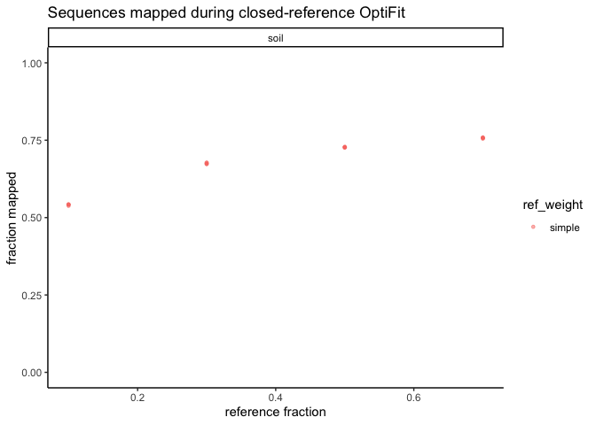<!-- -->

It looks like one result per parameter set is left over from before I
re-ran everything after reverting to the older silva version. [Here’s
what the plot looked like with the newest (buggy)
silva](https://github.com/SchlossLab/OptiFitAnalysis/blob/master/exploratory/2020-05/sub3_fit_all-seqs.md#fraction-of-sequences-that-map-to-the-reference).
Need to go back and figure out why those files didn’t get
removed/overwritten by Snakemake when I re-ran everything.

Let’s try a sanity check with open-reference – should all be 1.

``` r
optifit_split %>% 
  filter(tool == 'mothur', is.na(ref)) %>% 
  filter(dataset == 'soil') %>% 
  ggplot(aes(x=ref_frac, y=fraction_mapped, color=ref_weight)) +
  geom_point(alpha = 0.5, size=1) +
  facet_grid(dataset ~ method) +
  ylim(0, 1) +
  labs(title="Sequences mapped during open-reference OptiFit",
       x='reference fraction',
       y='fraction mapped')
```

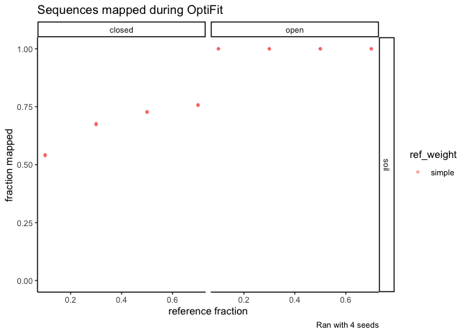<!-- -->

Did mothur’s list file format change in the latest dev version? The
fraction mapped values are the same as the reference fraction when the
ref weight is simple.

### is there a pattern?

``` r
debug_dat <- optifit_split %>% 
  filter(method == 'open') %>% 
  mutate(is_correct = fraction_mapped == 1) %>% 
  select(dataset, seed, method, fraction_mapped, is_correct, 
         sample_frac, ref_frac, ref_weight) %>%
  group_by(dataset, seed, ref_frac, ref_weight, is_correct) 

for (s in 1:2) {
  debug_dat %>% 
    filter(seed == s, ref_weight == 'simple', dataset == 'soil') %>% 
    pull(is_correct) %>% 
    print()
}
```

    ## [1] TRUE TRUE TRUE TRUE
    ## [1] TRUE TRUE TRUE TRUE

Pattern of correctness among ref fracs is flipped between seed 1 and 2

### diversity

``` r
optifit_split %>% 
  ggplot(aes(x = ref_frac, y = shannon, color = ref_weight)) +
  geom_jitter(size = 1, alpha = 0.3, width = 0.01) +
  stat_summary(fun = mean, geom = 'crossbar', alpha = 0.5) +
  geom_hline(aes(yintercept = mean_shannon), sum_opticlust) +
  facet_grid(dataset ~ method, scales = 'free') +
  labs(title='Diversity: OptiFit with split datasets',
       x='reference fraction',
       caption='Black line: _de novo_ clustering on the whole dataset') +
  theme(plot.caption = element_markdown())
```

## vsearch

For reference-based clustering, datasets were fit to the greengenes
database.

``` r
vsearch <- read_tsv(here('subworkflows/4_vsearch/results/vsearch_results.tsv')) %>% 
  mutate_perf()
vsearch_join <- vsearch %>% 
  full_join(opticlust) %>% 
  full_join(optifit_dbs %>% filter(ref == 'gg'))
```

``` r
vsearch_join %>% 
  ggplot(aes(x = method, y = mcc, color = tool)) +
  geom_boxplot() +
  facet_wrap('dataset') +
  ylim(0, 1) + 
  labs(x = '')
```

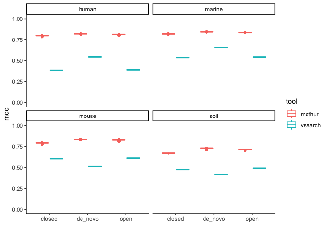<!-- -->

``` r
vsearch_join %>% 
  ggplot(aes(x = method, y = sec, color = tool)) +
  geom_boxplot() +
  facet_wrap('dataset') +
  labs(x = '')
```

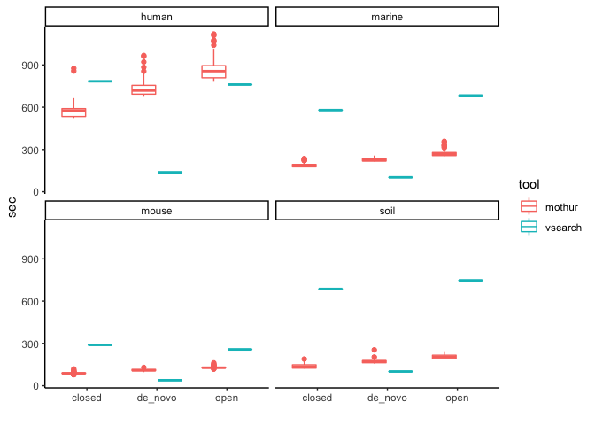<!-- -->

``` r
vsearch_join %>% 
  ggplot(aes(x = method, y = shannon, color = tool)) +
  geom_boxplot() +
  facet_wrap('dataset') +
  labs(x = '')
```

    ## Warning: Removed 400 rows containing non-finite values (stat_boxplot).

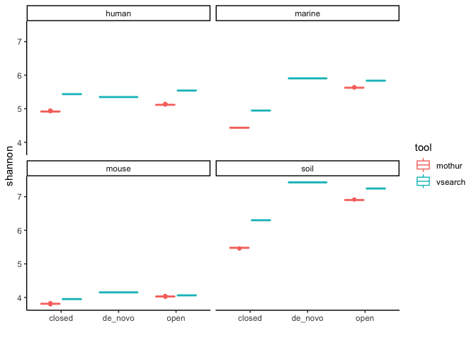<!-- -->

``` r
vsearch_join %>% #filter(method == 'closed') %>% 
  ggplot(aes(x = dataset, y = fraction_mapped, color = tool)) +
  geom_boxplot() + 
  ylim(0, 1) +
  facet_wrap('method') +
  labs(title="Sequences mapped during closed-reference OptiFit") +
  theme(plot.caption = element_markdown())
```

    ## Warning: Removed 400 rows containing non-finite values (stat_boxplot).

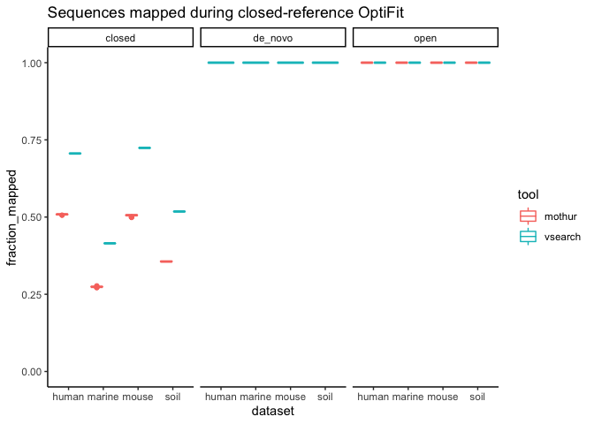<!-- -->

The fraction mapped for *de novo* open-reference is shown here as a
sanity check. Final plots will only include closed-reference.

## compare all mothur clustering strategies

``` r
opti_all <- list(optifit_dbs %>% mutate(strategy = glue('database_{ref}')),
                 optifit_split %>% mutate(strategy = 'self-split'),
                 opticlust %>% mutate(strategy = 'de_novo')) %>% 
  reduce(full_join)

sum_opti_all <- opti_all %>% 
  group_by(dataset, strategy, method) %>% 
  summarize(n = n(),
            mcc_median = median(mcc),  # TODO: tidy way to avoid this repetitiveness?
            sec_median = median(sec),
            mem_gb_median = median(mem_gb),
            frac_map_median = median(fraction_mapped))
head(sum_opti_all)
```

    ## # A tibble: 6 x 8
    ## # Groups:   dataset, strategy [3]
    ##   dataset strategy method     n mcc_median sec_median mem_gb_median
    ##   <chr>   <glue>   <chr>  <int>      <dbl>      <dbl>         <dbl>
    ## 1 human   databas… closed   100      0.800       576.          5.38
    ## 2 human   databas… open     100      0.815       856.         18.9 
    ## 3 human   databas… closed   100      0.555       451.          5.09
    ## 4 human   databas… open     100      0.809      1003.         18.4 
    ## 5 human   databas… closed   100      0.776       527.          5.22
    ## 6 human   databas… open     100      0.814       857.         20.1 
    ## # … with 1 more variable: frac_map_median <dbl>

``` r
sum_opti_all %>% 
  ggplot(aes(strategy, mcc_median, color = method)) +
  geom_point() +
  facet_wrap(dataset ~ .) +
  scale_color_manual(values = tri_colors) +
  ylim(0, 1) +
  #theme(axis.text.x = element_text(angle = 90, vjust = 0.5, hjust=1)) + 
  coord_flip() +
  labs(title = 'OTU Quality', x = '', y = 'Median MCC')
```

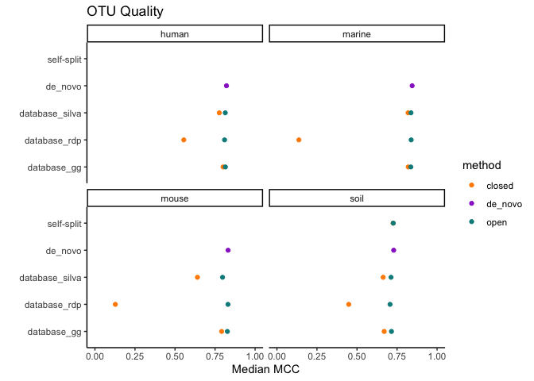<!-- -->

``` r
sum_opti_all %>% 
  ggplot(aes(strategy, sec_median, color = method)) +
  geom_point() +
  facet_wrap(dataset ~ ., scales = 'free_y') +
  scale_color_manual(values = tri_colors) +
  theme(axis.text.x = element_text(angle = 45, vjust = 1, hjust=1))
```

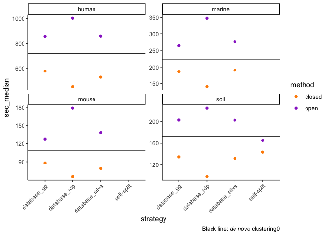<!-- -->

``` r
sum_opti_all %>% 
  ggplot(aes(strategy, mem_gb_median, color = method)) +
  geom_point() +
  facet_wrap(dataset ~ ., scales = 'free_y') +
  scale_color_manual(values = tri_colors) +
  theme(axis.text.x = element_text(angle = 90, vjust = 0.5, hjust=1))
```

<!-- -->

``` r
sum_opti_all %>% 
  filter(strategy != 'de_novo') %>% 
  ggplot(aes(strategy, frac_map_median, color = method)) +
  geom_point() +
  facet_wrap(dataset ~ .) +
  scale_color_manual(values = tri_colors) +
  theme(axis.text.x = element_text(angle = 90, vjust = 0.5, hjust=1))
```

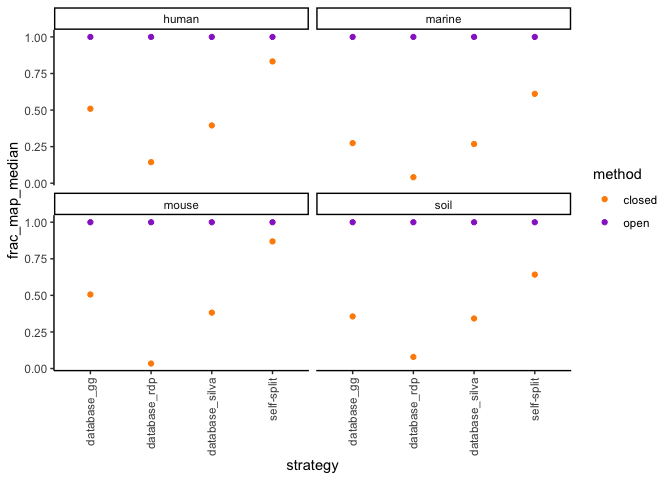<!-- -->

## compare mothur & vsearch with just the human dataset

``` r
all_human <- list(opti_all %>% 
                    filter(dataset == 'human', 
                           ref == 'gg' | method == 'de_novo'),
                 vsearch %>% filter(dataset == 'human')
                 ) %>% 
  reduce(full_join) %>% 
  mutate(strategy = case_when(
    method == 'de_novo' ~ method,
    TRUE ~ as.character(glue('{method}_ref_{ref}'))))

sum_all_human <- all_human %>% 
  group_by(tool, strategy, method) %>% 
  summarize(n = n(),
            mcc_median = median(mcc),  # TODO: tidy way to avoid this repetitiveness?
            sec_median = median(sec),
            mem_gb_median = median(mem_gb),
            frac_map_median = median(fraction_mapped))
head(sum_all_human)
```

    ## # A tibble: 6 x 8
    ## # Groups:   tool, strategy [6]
    ##   tool  strategy method     n mcc_median sec_median mem_gb_median
    ##   <chr> <chr>    <chr>  <int>      <dbl>      <dbl>         <dbl>
    ## 1 moth… closed_… closed   100      0.800       576.         5.38 
    ## 2 moth… de_novo  de_no…   100      0.821       718.         5.05 
    ## 3 moth… open_re… open     100      0.815       856.        18.9  
    ## 4 vsea… closed_… closed     1      0.385       784.         1.01 
    ## 5 vsea… de_novo  de_no…     1      0.547       138.         0.164
    ## 6 vsea… open_re… open       1      0.390       761.         0.999
    ## # … with 1 more variable: frac_map_median <dbl>

``` r
sum_all_human %>% 
  ggplot(aes(strategy, mcc_median, color = tool)) +
  geom_point() +
  #facet_wrap(tool ~ .) +
  ylim(0, 1) +
  scale_color_manual(values = tri_colors) +
  #theme(axis.text.x = element_text(angle = 90, vjust = 0.5, hjust=1)) + 
  coord_flip()
```

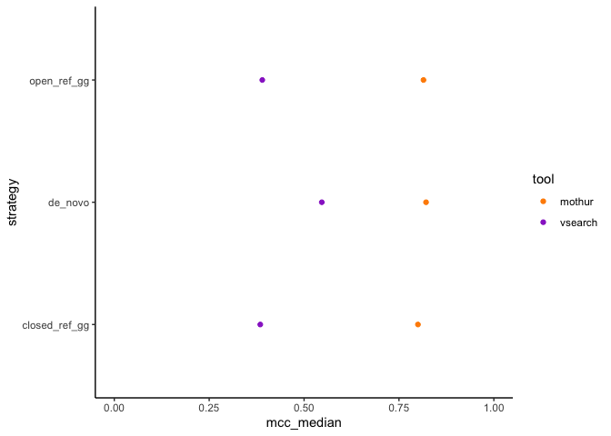<!-- -->

``` r
sum_all_human %>% 
  pivot_longer(c(mcc_median, sec_median, mem_gb_median, frac_map_median), names_to = 'metric') %>% 
  ggplot(aes(strategy, value, color = tool)) +
  geom_point() +
  facet_wrap('metric', scales = 'free')
```

    ## Warning: Removed 1 rows containing missing values (geom_point).

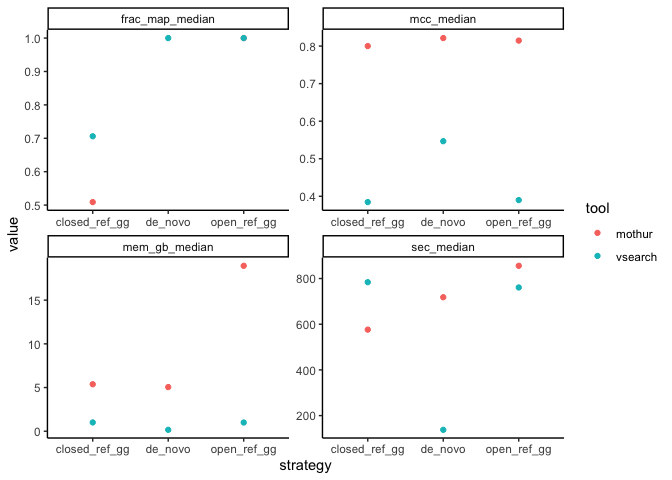<!-- -->

``` r
all_human %>% 
  pivot_longer(c(mcc, sec, mem_gb, fraction_mapped), names_to = 'metric') %>% 
  ggplot(aes(strategy, value, color = tool)) +
  geom_boxplot() +
  facet_wrap('metric', scales = 'free') +
  labs(x='', y='',  
       caption = 'Only the human dataset is shown here. The patterns are similar with other datasets.')
```

    ## Warning: Removed 100 rows containing non-finite values (stat_boxplot).

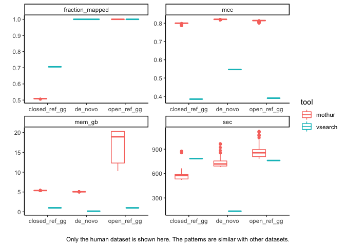<!-- -->
