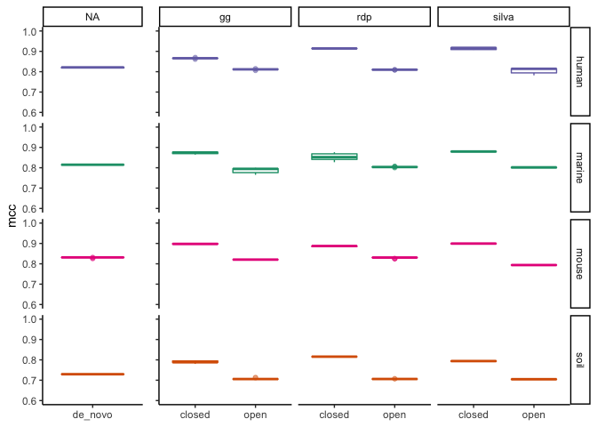
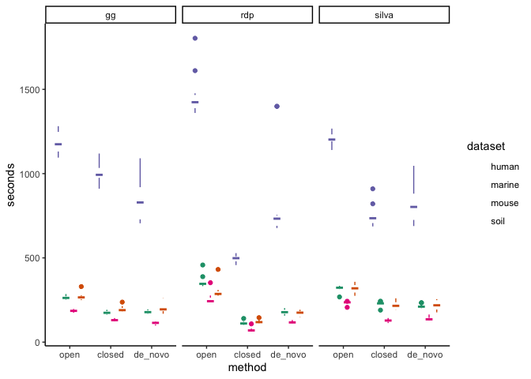

Exploratory Plots
================
5/27/2020

``` r
library(cowplot)
library(ggtext)
library(here)
library(knitr)
library(tidyverse)
theme_set(theme_classic())
color_palette <- RColorBrewer::brewer.pal(4, "Dark2")
dataset_colors <- c(
  human = color_palette[[3]],
  marine = color_palette[[1]],
  mouse = color_palette[[4]],
  soil = color_palette[[2]]
)
```

# Fitting datasets to a reference database vs *de novo* clustering

``` r
relevel_method <- function(df) {
  df %>%
    mutate(method = fct_relevel(method, c("open", "closed", "de_novo")))
}

plot_box_time <- function(df) {
  df %>%
    group_by(dataset, method) %>%
    ggplot(aes(x = method, y = s, color = dataset)) +
    geom_boxplot() +
    scale_color_manual(values = dataset_colors) +
    facet_wrap("ref") +
    ylim(0,2100) +
    labs(y = 'seconds') +
    theme(axis.title.x = element_blank())
}
```

### Performance as measured by MCC

``` r
sensspec_fit <-
  read_tsv(here('subworkflows/2_fit_reference_db/results/sensspec.tsv')) 
sensspec_clust <- read_tsv(here('subworkflows/1_prep_samples/results/sensspec.tsv')) %>% 
  select(-ref) %>% 
  group_by(dataset) %>% 
  summarize(mean_mcc = mean(mcc))
#sensspec <- bind_rows(sensspec_fit, sensspec_clust)
sensspec_fit %>%
  group_by(dataset, method) %>%
  ggplot(aes(x = method, y = mcc, color = dataset)) +
  geom_hline(aes(yintercept = mean_mcc), sensspec_clust) +
  geom_boxplot(alpha = 0.5) +
  scale_color_manual(values = dataset_colors) +
  ylim(0.5, 1) +
  facet_grid(dataset ~ ref) +
  labs(caption = "The black line represents the *de novo* clustering mcc sccore.") +
  theme(legend.position = "None",
        axis.title.x = element_blank(),
        plot.caption = element_markdown())
```

<!-- -->

### Performance as measured by runtime

``` r
benchmarks_fit <-
  read_tsv(here('subworkflows/2_fit_reference_db/results/benchmarks.tsv'))
benchmarks_clust <- read_tsv(here('subworkflows/1_prep_samples/results/benchmarks.tsv'))

time_plot_fit <- benchmarks_fit %>% 
  plot_box_time() +
  theme(axis.text.y = element_blank(),
        axis.title.y = element_blank())
time_plot_clust <- benchmarks_clust %>% 
  plot_box_time() +
  theme(legend.position = "None")

plot_grid(time_plot_clust, time_plot_fit,
          align = "h", rel_widths = c(1,3))
```

<!-- -->

### Reference & dataset sizes

``` r
dataset_sizes <-
  read_tsv(here('subworkflows/1_prep_samples/results/dataset_sizes.tsv'))
kable(dataset_sizes)
```

| dataset | num\_seqs |
| :------ | --------: |
| human   |    261539 |
| marine  |    161561 |
| mouse   |     68111 |
| soil    |    219754 |

``` r
ref_sizes <-
  read_tsv(here('subworkflows/2_fit_reference_db/results/ref_sizes.tsv'))
kable(ref_sizes)
```

| reference | region | num\_seqs | dataset\_filter |
| :-------- | :----- | --------: | :-------------- |
| silva     | v4     |     66531 | human           |
| gg        | v4     |    104943 | human           |
| rdp       | v4     |      6224 | human           |
| silva     | v4     |     66556 | marine          |
| gg        | v4     |    104975 | marine          |
| rdp       | v4     |      6223 | marine          |
| silva     | v4     |     66297 | mouse           |
| gg        | v4     |    104739 | mouse           |
| rdp       | v4     |      6219 | mouse           |
| silva     | v4     |     66593 | soil            |
| gg        | v4     |    104994 | soil            |
| rdp       | v4     |      6224 | soil            |

### Fraction of sequences that map to the reference

``` r
fractions <- read_tsv(here('subworkflows/2_fit_reference_db/results/fraction_reads_mapped.tsv'))
fractions %>% 
  ggplot(aes(x=dataset, y=fraction_mapped, color=dataset)) +
  geom_boxplot(alpha = 0.5) +
  scale_color_manual(values = dataset_colors) +
  facet_wrap("ref") +
  ylim(0, 1) +
  labs(title="Sequences mapped during closed-reference OptiFit")
```

<!-- -->
