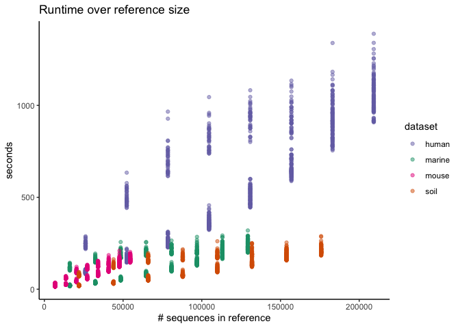

Exploratory Plots
================
Aug. 2020

``` r
library(cowplot)
library(ggtext)
library(here)
library(knitr)
library(tidyverse)
theme_set(theme_classic())
color_palette <- RColorBrewer::brewer.pal(4, "Dark2")
dataset_colors <- c(
  human = color_palette[[3]],
  marine = color_palette[[1]],
  mouse = color_palette[[4]],
  soil = color_palette[[2]]
)
```

``` r
sensspec_fit <-
  read_tsv(here('subworkflows/3_fit_sample_subset/results/sensspec.tsv'))
```

## Subsetting datasets with different reference sizes

``` r
sensspec_fit %>%
  filter(method == 'open') %>% 
  group_by(dataset, ref_weight) %>%
  ggplot(aes(x = as.factor(ref_frac), y = mcc, color = dataset)) +
  geom_boxplot() +
  scale_color_manual(values = dataset_colors) +
  ylim(0.5, 1) +
  facet_grid(dataset ~ ref_weight) +
  labs(title='Open-reference OptiFit Performance',
       x='reference fraction')
```

<!-- -->

``` r
sensspec_fit %>%
  filter(method == 'closed') %>% 
  group_by(dataset, ref_weight) %>%
  ggplot(aes(x = as.factor(ref_frac), y = mcc, color = dataset)) +
  geom_boxplot() +
  scale_color_manual(values = dataset_colors) +
  ylim(0.5, 1) +
  facet_grid(dataset ~ ref_weight) +
  labs(title='Closed-reference OptiFit Performance',
       x='reference fraction')
```

<!-- -->

sample fraction = 0.2

## Runtime

``` r
runtime <- full_join(
  read_tsv(here('subworkflows/3_fit_sample_subset/results/benchmarks.tsv')),
  read_tsv(here('subworkflows/3_fit_sample_subset/results/input_sizes.tsv'))
  )
runtime %>% ggplot(aes(x=num_ref_seqs, y=s, color=dataset)) +
  geom_point(alpha = 0.5) +
  scale_color_manual(values = dataset_colors) +
  labs(title = 'Runtime over reference size',
       x = '# sequences in reference',
       y = 'seconds')
```

<!-- -->

``` r
runtime %>% ggplot(aes(x=num_sample_seqs, y=s, color=dataset)) +
  geom_point(alpha = 0.5) +
  scale_color_manual(values = dataset_colors) +
  labs(title = 'Runtime over sample size',
       x = '# sequences in sample',
       y = 'seconds')
```

<!-- -->

## Fraction of sequences that map to the reference

``` r
fractions <- read_tsv(here('subworkflows/3_fit_sample_subset/results/fraction_reads_mapped.tsv'))
fractions %>% 
  group_by(dataset, ref_weight, ref_frac) %>% 
  ggplot(aes(x=ref_frac, y=fraction_mapped, color=dataset)) +
  geom_jitter(alpha = 0.5, width = 0.01, size=1) +
  scale_color_manual(values = dataset_colors) +
  facet_wrap("ref_weight") +
  ylim(0, 1) +
  labs(title="Sequences mapped during closed-reference OptiFit",
       x='reference fraction',
       y='fraction mapped')
```

<!-- -->
