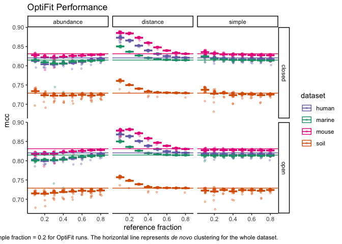
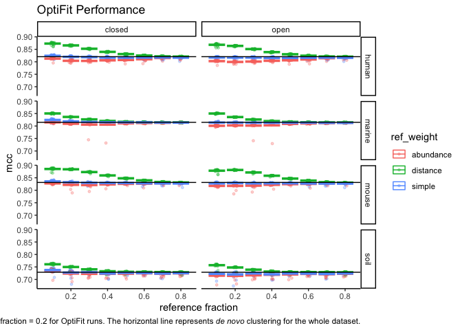
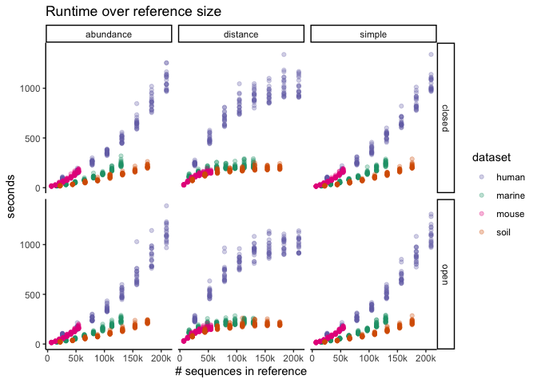
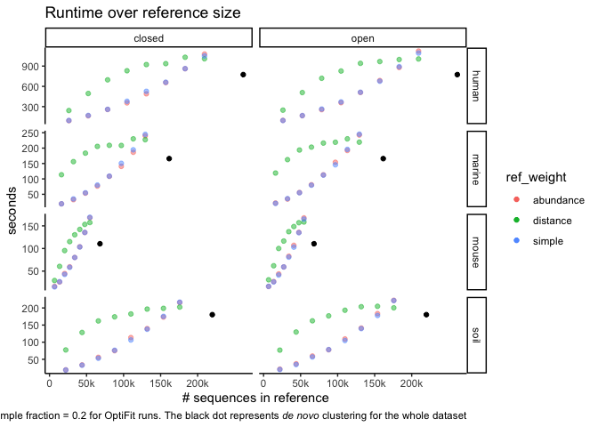
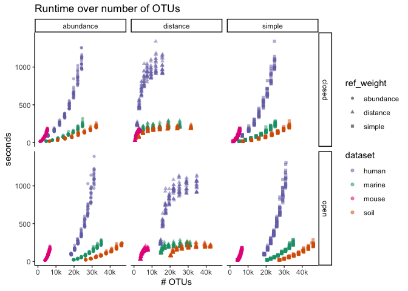
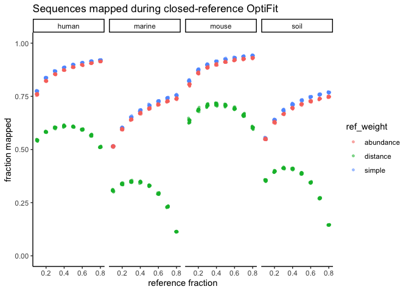

Exploratory Plots
================
Sept. 2020

``` r
library(cowplot)
library(ggtext)
library(here)
library(knitr)
library(tidyverse)
theme_set(theme_classic())
color_palette <- RColorBrewer::brewer.pal(4, "Dark2")
dataset_colors <- c(
  human = color_palette[[3]],
  marine = color_palette[[1]],
  mouse = color_palette[[4]],
  soil = color_palette[[2]]
)
full_join_files <- function(filenames) {
  filenames %>% 
  lapply(read_tsv) %>% 
  reduce(full_join)
}
```

``` r
dat <- c('https://raw.githubusercontent.com/SchlossLab/OptiFitAnalysis/4fa7127bb6bacaa63657f0c18c0a8c6b6d18ebe7/subworkflows/3_fit_sample_subset/results/sensspec.tsv?token=AEHR6TOTYRF3XTCACDHGFRK7QRYH2',
              'https://raw.githubusercontent.com/SchlossLab/OptiFitAnalysis/4fa7127bb6bacaa63657f0c18c0a8c6b6d18ebe7/subworkflows/3_fit_sample_subset/results/benchmarks.tsv?token=AEHR6TLJWOKI4YC6OJ6BRMC7QRYXY',
              'https://raw.githubusercontent.com/SchlossLab/OptiFitAnalysis/4fa7127bb6bacaa63657f0c18c0a8c6b6d18ebe7/subworkflows/3_fit_sample_subset/results/input_sizes.tsv?token=AEHR6TJVM5FBTZRRY4USOYS7QRY6U',
              'https://raw.githubusercontent.com/SchlossLab/OptiFitAnalysis/4fa7127bb6bacaa63657f0c18c0a8c6b6d18ebe7/subworkflows/3_fit_sample_subset/results/gap_counts.tsv?token=AEHR6TMQKLHG2RNGUZQI35C7QRY5G',
              'https://raw.githubusercontent.com/SchlossLab/OptiFitAnalysis/4fa7127bb6bacaa63657f0c18c0a8c6b6d18ebe7/subworkflows/3_fit_sample_subset/results/fraction_reads_mapped.tsv?token=AEHR6TIY56KPVNGRKCOAYI27QRZBW') %>% 
  full_join_files() %>% 
  mutate(num_total_seqs = num_ref_seqs + num_sample_seqs,
         gaps_frac = n_gaps / total_chars)

denovo <- c('https://raw.githubusercontent.com/SchlossLab/OptiFitAnalysis/4fa7127bb6bacaa63657f0c18c0a8c6b6d18ebe7/subworkflows/1_prep_samples/results/sensspec.tsv?token=AEHR6TOXMAB75QDAO7CGTA27QR4KQ',
            'https://raw.githubusercontent.com/SchlossLab/OptiFitAnalysis/4fa7127bb6bacaa63657f0c18c0a8c6b6d18ebe7/subworkflows/1_prep_samples/results/benchmarks.tsv?token=AEHR6TI35D2TNWARGGL37W27QR4MM',
            'https://raw.githubusercontent.com/SchlossLab/OptiFitAnalysis/4fa7127bb6bacaa63657f0c18c0a8c6b6d18ebe7/subworkflows/1_prep_samples/results/dataset_sizes.tsv?token=AEHR6TJKE2C7SRDUZSGRTCC7QR4MG') %>% 
  full_join_files() %>% 
  mutate(ref_frac = 1)

denovo_sum <- denovo %>% group_by(dataset) %>% summarize(mean_mcc=mean(mcc), 
                                                         sd_mcc=sd(mcc),
                                                         mean_sec=mean(s),
                                                         sd_sec=sd(s),
                                                         num_ref_seqs = mean(num_seqs))
denovo_sum
```

    ## # A tibble: 4 x 6
    ##   dataset mean_mcc    sd_mcc mean_sec sd_sec num_ref_seqs
    ##   <chr>      <dbl>     <dbl>    <dbl>  <dbl>        <dbl>
    ## 1 human      0.821 0.00123       774.   84.4       261539
    ## 2 marine     0.815 0.0000999     166.   16.6       161561
    ## 3 mouse      0.831 0.00103       110.   13.2        68111
    ## 4 soil       0.729 0.00267       180.   23.4       219754

## Subsetting datasets with different reference sizes

Sample fraction of 0.2 with 20 different seeds.

``` r
dat %>%
  ggplot(aes(x = ref_frac, y = mcc, color = dataset)) +
  geom_jitter(size = 1, alpha = 0.3, width = 0.01) +
  stat_summary(fun = mean, geom = 'crossbar') +
  scale_color_manual(values = dataset_colors) +
  facet_grid(method ~ ref_weight) +
  labs(title='OptiFit Performance',
       x='reference fraction')
```

<!-- -->

``` r
dat %>%
  ggplot(aes(x = ref_frac, y = mcc, color = dataset)) +
  geom_jitter(size = 1, alpha = 0.3, width = 0.01) +
  stat_summary(fun = mean, geom = 'crossbar') +
  geom_hline(aes(yintercept = mean_mcc, color = dataset), denovo_sum) +
  scale_color_manual(values = dataset_colors) +
  facet_grid(method ~ ref_weight) +
  labs(title='OptiFit Performance',
       x='reference fraction',
       caption='Sample fraction = 0.2 for OptiFit runs.\nThe horizontal line represents _de novo_ clustering for the whole dataset.') +
  theme(plot.caption = element_markdown())
```

<!-- -->

``` r
dat %>%
  ggplot(aes(x = ref_frac, y = mcc, color = ref_weight)) +
  geom_jitter(size = 1, alpha = 0.3, width = 0.01) +
  stat_summary(fun = mean, geom = 'crossbar') +
  geom_hline(aes(yintercept = mean_mcc), denovo_sum) +
  facet_grid(dataset ~ method) +
  labs(title='OptiFit Performance',
       x='reference fraction',
       caption='Sample fraction = 0.2 for OptiFit runs. The horizontal line represents _de novo_ clustering for the whole dataset.') +
  theme(plot.caption = element_markdown())
```

<!-- -->

The performance is very consistent across reference fractions when
weighting sequences by abundance or not at all (simple). When weighting
by distance, the performance decreases as the reference fraction
increases. This is expected because a larger fraction means **more**
sequences with **fewer** pairwise distances under the 0.03 threshold are
included in the reference.

## Runtime

``` r
dat %>% ggplot(aes(x=num_ref_seqs, y=s, color=dataset)) +
  geom_point(alpha = 0.3) +
  facet_grid(method ~ ref_weight) +
  scale_color_manual(values = dataset_colors) +
  scale_x_continuous(breaks = seq(0, 200000, 50000),
                     labels = c('0', '50k', '100k', '150k', '200k')) +
  labs(title = 'Runtime over reference size',
       x = '# sequences in reference',
       y = 'seconds')
```

<!-- -->

``` r
dat %>% group_by(num_ref_seqs, dataset, ref_weight, method) %>% 
  summarize(mean_sec=mean(s)) %>% 
  ggplot(aes(x=num_ref_seqs, y=mean_sec, color=ref_weight)) +
  geom_point(alpha = 0.5) +
  geom_point(aes(x=num_ref_seqs, y=mean_sec, color=NULL), denovo_sum) +
  facet_grid(dataset ~ method, scales = 'free') +
  #scale_color_manual(values = dataset_colors) +
  scale_x_continuous(breaks = seq(0, 200000, 50000),
                     labels = c('0', '50k', '100k', '150k', '200k')) +
  labs(title = 'Runtime over reference size',
       x = '# sequences in reference',
       y = 'seconds',
       caption = 'Sample fraction = 0.2 for OptiFit runs.\nThe black dot represents _de novo_ clustering for the whole dataset') +
  theme(plot.caption = element_markdown())
```

<!-- -->

Runtime is also fairly consistent regardless of weighting method. For
abundance and simple weighting, runtime seems to continue increasing
roughly linearly (maybe a little worse than linear). When weighting by
distance, runtime reaches a plateau sooner than other selection methods
as the size of the reference increases. Perhaps the sequences with the
most similarities are the most influential over OTU clustering, so after
you reach some critical number of similarities, the runtime doesn’t
increase as much. I’m not sure why the human dataset takes so much
longer than the others.

``` r
dat %>%
  ggplot(aes(x=numotus, y=s, color=dataset, shape = ref_weight)) +
  geom_point(alpha = 0.5) +
  facet_grid(method ~ ref_weight) +
  scale_color_manual(values = dataset_colors) +
  scale_x_continuous(breaks = seq(0, 40000, 10000),
                     labels = c('0', '10k', '20k', '30k', '40k')) +
  labs(title = 'Runtime over number of OTUs',
       x = '# OTUs',
       y = 'seconds')
```

<!-- -->

Open-reference clustering has more OTUs because it will cluster any
sequences *de novo* that do not fit into existing OTUs, while
closed-reference clustering throws them out. This plot is confounded by
the number of sequences in the reference, perhaps I should re-plot it as
the ratio of OTUs to reference sequences?

## Fraction of sequences that map to the reference

``` r
dat %>% 
  filter(method == 'closed') %>% 
  group_by(dataset, ref_weight, ref_frac) %>% 
  ggplot(aes(x=ref_frac, y=fraction_mapped, color=dataset)) +
  geom_jitter(alpha = 0.5, width = 0.01, size=1) +
  scale_color_manual(values = dataset_colors) +
  facet_wrap("ref_weight") +
  ylim(0, 1) +
  labs(title="Sequences mapped during closed-reference OptiFit",
       x='reference fraction',
       y='fraction mapped')
```

<!-- -->

``` r
dat %>% 
  filter(method == 'closed') %>% 
  group_by(dataset, ref_weight, ref_frac) %>% 
  ggplot(aes(x=ref_frac, y=fraction_mapped, color=ref_weight)) +
  geom_jitter(alpha = 0.5, width = 0.01, size=1) +
  #scale_color_manual(values = dataset_colors) +
  facet_wrap("dataset", nrow=1) +
  ylim(0, 1) +
  labs(title="Sequences mapped during closed-reference OptiFit",
       x='reference fraction',
       y='fraction mapped')
```

<!-- -->

The fraction of sequences that are able to be fit to the reference in
closed-reference clustering increases as the reference size increases
when weighting sequences by abundance or not at all for reference
selection. It’s also remarkably stable between abundance & simple
weighting, and between all seeds. Weighting by distance performs poorly,
likely because the top n sequences with the most pairwise similarities
are included in the reference, leaving sequences with few similarities
to then be fit to the highly-connected reference.
