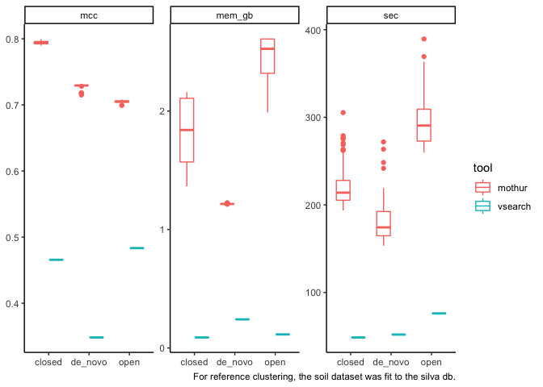
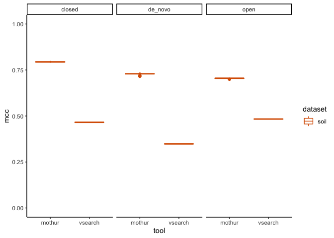
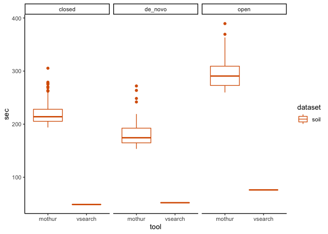
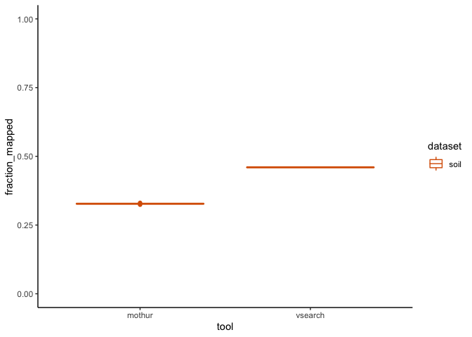

VSEARCH clustering
================
Oct. 2020

``` r
library(cowplot)
library(ggtext)
library(glue)
library(here)
library(knitr)
library(tidyverse)
theme_set(theme_classic())
color_palette <- RColorBrewer::brewer.pal(4, "Dark2")
dataset_colors <- c(
  human = color_palette[[3]],
  marine = color_palette[[1]],
  mouse = color_palette[[4]],
  soil = color_palette[[2]]
)
set.seed(2018)

optifit <- c('subworkflows/2_fit_reference_db/results/sensspec.tsv',
             'subworkflows/2_fit_reference_db/results/benchmarks.tsv',
             'subworkflows/2_fit_reference_db/results/fraction_reads_mapped.tsv'
             ) %>% 
  here() %>% 
  map(read_tsv) %>%
  reduce(full_join) 
opticlust <- c('subworkflows/1_prep_samples/results/sensspec.tsv',
               'subworkflows/1_prep_samples/results/benchmarks.tsv') %>% 
  here() %>% 
  map(read_tsv) %>% 
  reduce(full_join) 
vsearch <- read_tsv(here('subworkflows/4_vsearch/results/vsearch_results.tsv'))

dat <- bind_rows(optifit, opticlust) %>% 
  mutate(tool = "mothur") %>% 
  bind_rows(vsearch) %>% 
  mutate(mem_mb = max_rss,
         mem_gb = mem_mb / 1024,
         sec = s)
```

For now, just going to show silva v4 for reference-clustering with the
soil dataset. Will expand to include more variables later.

``` r
dat_filt <- dat %>% filter(ref %in% c('silva', NA), 
                           region %in% c('bact_v4', NA),
                           dataset == 'soil') %>% 
  select(dataset, ref, region, tool, method, mcc, sec, mem_gb, numotus, fraction_mapped) %>% 
  mutate(tool_method = glue("{tool}_{method}"))


dat_filt %>% pivot_longer(c(mcc, sec, mem_gb), names_to = 'metric') %>% 
  ggplot(aes(x = method, y = value, color = tool)) +
  geom_boxplot() +
  facet_wrap('metric', scales = 'free') + 
  labs(caption = "For reference clustering, the soil dataset was fit to the silva db.") +
  theme(axis.title = element_blank())
```

<!-- -->

## OTU Quality

``` r
dat_filt %>% ggplot(aes(x = tool, y = mcc, color = dataset)) +
  geom_boxplot() +
  facet_wrap('method') +
  scale_color_manual(values = dataset_colors) +
  ylim(0, 1)
```

<!-- -->

## Performance

``` r
dat_filt %>% ggplot(aes(x = tool, y = sec, color = dataset)) +
  geom_boxplot() +
  facet_wrap('method') +
  scale_color_manual(values = dataset_colors)
```

<!-- -->

``` r
dat_filt %>% ggplot(aes(x = tool, y = mem_gb, color = dataset)) +
  geom_boxplot() +
  facet_wrap('method') +
  scale_color_manual(values = dataset_colors)
```

<!-- -->

## Fraction reads mapped during closed-reference clustering

``` r
dat_filt %>% filter(method == 'closed') %>% 
  ggplot(aes(x = tool, y = fraction_mapped, color = dataset)) +
  geom_boxplot() +
  scale_color_manual(values = dataset_colors) +
  ylim(0, 1)
```

<!-- -->
