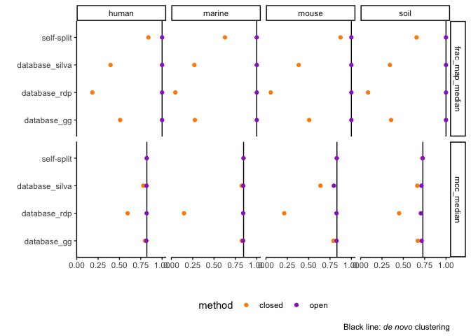
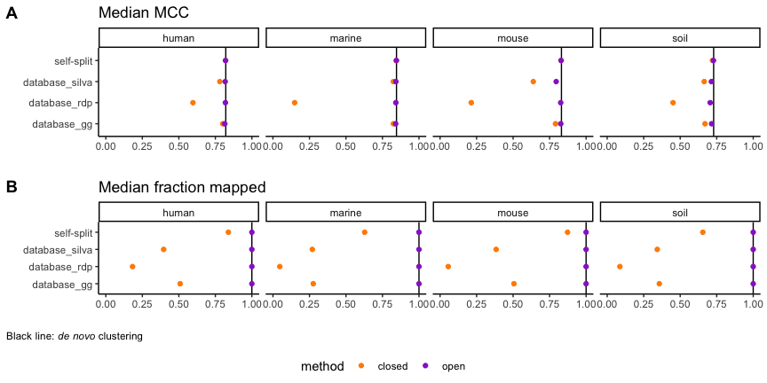
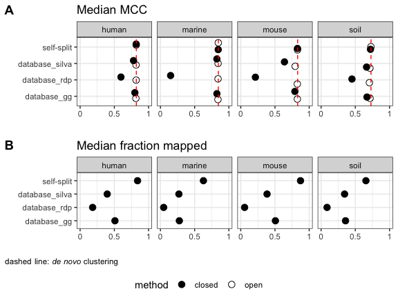
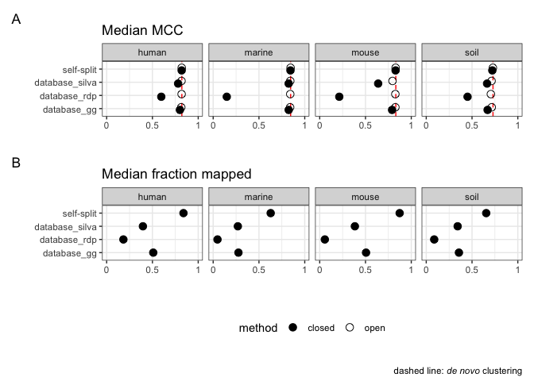
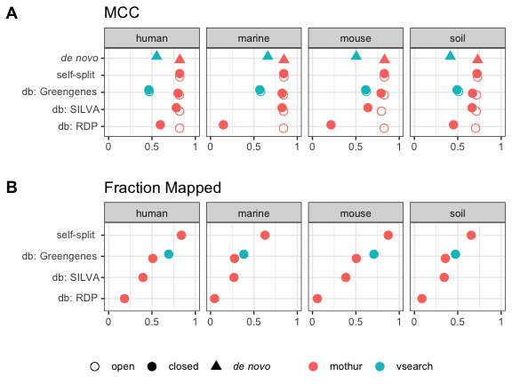
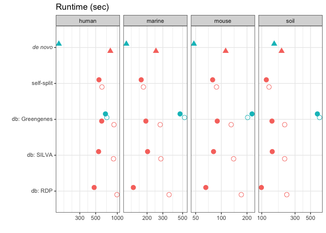
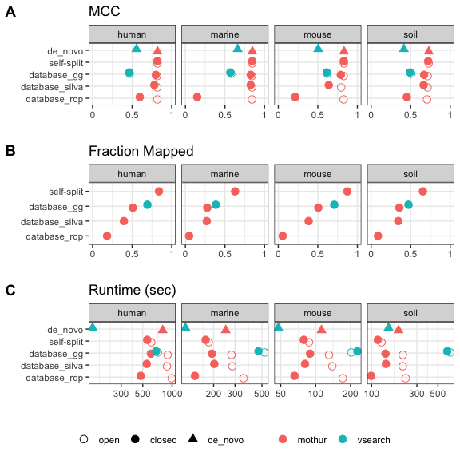

Comparing OTU quality across clustering strategies
================
2021-06-08

### data prep

``` r
set.seed(20210509)
library(cowplot)
library(ggtext)
library(glue)
library(here)
library(knitr)
library(tidyverse)

color_palette <- RColorBrewer::brewer.pal(4, "Dark2")
dataset_colors <- c(
  human = color_palette[[3]],
  marine = color_palette[[1]],
  mouse = color_palette[[4]],
  soil = color_palette[[2]]
)
tri_colors <-  c("darkorange","darkorchid","cyan4") # https://allisonhorst.github.io/palmerpenguins/articles/intro.html
mutate_perf <- function(dat) {
  dat %>% 
    mutate(mem_mb = max_rss,
           mem_gb = mem_mb / 1024) %>% 
    rename(sec = s)
}
plot_denovo_hline <- function(yint, dat = sum_opticlust) {
  list(geom_hline(data = dat, aes(yintercept = {{yint}})),
       labs(caption = "Black line: _de novo_ clustering"),
       theme(plot.caption = element_markdown())
  )
}
select_cols <- function(dat) {
  dat %>% 
    select(dataset, strategy, method, tool, mcc, sec, mem_gb, fraction_mapped)
}
group_sum <- function(dat) {
  dat %>% 
  group_by(dataset, tool, method, strategy) %>% 
  summarize(mcc_median = median(mcc),  # TODO: tidy way to avoid this repetitiveness?
            sec_median = median(sec),
            mem_gb_median = median(mem_gb),
            frac_map_median = median(fraction_mapped))
}
```

``` r
opticlust <- read_tsv(here('subworkflows/1_prep_samples/results/opticlust_results.tsv')) %>% 
  full_join(read_tsv(here('subworkflows/1_prep_samples/results/dataset_sizes.tsv'))) %>% 
  mutate_perf() %>% mutate(fraction_mapped = 1, strategy = method)
sum_opticlust <- opticlust %>% group_sum()
optifit_dbs <- read_tsv(here('subworkflows/2_fit_reference_db/results/optifit_dbs_results.tsv')) %>% 
  mutate_perf()
optifit_split <- read_tsv(here('subworkflows/3_fit_sample_split/results/optifit_split_results.tsv')) %>% 
  mutate_perf()
optifit_all <- list(optifit_dbs %>% 
                   mutate(strategy = glue('database_{ref}')),
                 optifit_split %>% 
                   mutate(strategy = 'self-split')) %>% 
  reduce(full_join)
sum_optifit <- optifit_all %>% group_sum()
vsearch <- read_tsv(here('subworkflows/4_vsearch/results/vsearch_results.tsv')) %>% 
  mutate_perf() %>% 
  mutate(strategy = case_when(
    method == 'de_novo' ~ method,
    TRUE ~ as.character(glue('database_{ref}')))) 
mothur_vsearch <- list(optifit_all, opticlust, vsearch) %>% 
  lapply(select_cols) %>% 
  reduce(bind_rows) %>% 
  mutate(method = as.character(method),
         strategy = as.character(strategy))
sum_all <- mothur_vsearch %>% group_sum()
head(sum_all)
```

    ## # A tibble: 6 x 8
    ## # Groups:   dataset, tool, method [3]
    ##   dataset tool   method  strategy       mcc_median sec_median mem_gb_median
    ##   <chr>   <chr>  <chr>   <chr>               <dbl>      <dbl>         <dbl>
    ## 1 human   mothur closed  database_gg         0.800       606.          5.38
    ## 2 human   mothur closed  database_rdp        0.597       476.          5.10
    ## 3 human   mothur closed  database_silva      0.780       549.          5.22
    ## 4 human   mothur closed  self-split          0.819       556.          5.09
    ## 5 human   mothur de_novo de_novo             0.821       800.          5.06
    ## 6 human   mothur open    database_gg         0.815       899.         20.3 
    ## # … with 1 more variable: frac_map_median <dbl>

### make the strategy & method labels prettier

``` r
sum_all <- sum_all %>%
  mutate(
    strategy = factor(
      case_when(
        strategy == "de_novo"        ~ "_de novo_",
        strategy == 'database_rdp'   ~ "db: RDP",
        strategy == 'database_silva' ~ "db: SILVA",
        strategy == 'database_gg'    ~ "db: Greengenes",
        TRUE                         ~ strategy
      ),
      levels = c('db: RDP', 'db: SILVA', 'db: Greengenes', 
                 'self-split',  '_de novo_')
    ),
    method = factor(
      case_when(method == "de_novo" ~ "_de novo_",
                TRUE                ~ method),
      levels = c('open', 'closed', '_de novo_')
    )
  )
head(sum_all)
```

    ## # A tibble: 6 x 8
    ## # Groups:   dataset, tool, method [3]
    ##   dataset tool   method    strategy       mcc_median sec_median mem_gb_median
    ##   <chr>   <chr>  <fct>     <fct>               <dbl>      <dbl>         <dbl>
    ## 1 human   mothur closed    db: Greengenes      0.800       606.          5.38
    ## 2 human   mothur closed    db: RDP             0.597       476.          5.10
    ## 3 human   mothur closed    db: SILVA           0.780       549.          5.22
    ## 4 human   mothur closed    self-split          0.819       556.          5.09
    ## 5 human   mothur _de novo_ _de novo_           0.821       800.          5.06
    ## 6 human   mothur open      db: Greengenes      0.815       899.         20.3 
    ## # … with 1 more variable: frac_map_median <dbl>

## facet\_grid()

``` r
sum_optifit %>% 
  pivot_longer(c(frac_map_median, mcc_median), names_to = 'quality_metric') %>% 
  ggplot(aes(strategy, value, color = method)) + 
  plot_denovo_hline(yint = value, dat = sum_opticlust %>% 
                      pivot_longer(c(frac_map_median, mcc_median), 
                                   names_to = 'quality_metric')) +
  geom_point() +
  facet_grid(quality_metric ~ dataset) +
  scale_color_manual(values = tri_colors) +
  coord_flip() +
  labs(x = '', y = '')  + 
  guides(color = guide_legend(nrow = 1)) +
  theme_classic() +
  theme(legend.position = "bottom")
```

<!-- -->

Problems:

-   The sideways grid labels are hard to read.
-   There’s too much whitespace around the legend.

## cowplot

``` r
plot_quality <- function(dat, y_val, title = '') {
  dat %>% 
    ggplot(aes(strategy, {{ y_val }}, color = method)) + 
    geom_hline(data = sum_opticlust, aes(yintercept = {{ y_val }})) +
    geom_point() +
    facet_wrap(dataset ~ ., nrow=1) +
    scale_color_manual(values = tri_colors) +
    ylim(0, 1) +
    coord_flip() +
    labs(x = '', y = '', title = title) + 
    theme_classic() +
    theme(legend.position="none")
}
mcc_plot <- sum_optifit %>% 
  plot_quality(mcc_median, title = 'Median MCC')
frac_plot <- sum_optifit %>% 
  plot_quality(frac_map_median, title = 'Median fraction mapped')  + 
  labs(caption = "Black line: _de novo_ clustering") +
  theme(plot.caption = element_markdown(hjust = 0),
        plot.caption.position = 'plot')

shared_legend <- get_legend(mcc_plot + 
                              guides(color = guide_legend(nrow = 1)) +
                              theme(legend.position = "bottom")
                            )

main_plot <- plot_grid(mcc_plot, frac_plot, 
                       ncol = 1, align = 'v', labels = 'AUTO')

plot_grid(main_plot, shared_legend, 
          ncol = 1, rel_heights = c(1, 0.1))
```

<!-- -->

TODO:

-   Get caption & legend side-by-side. Maybe use `ggannotate` instead of
    `labs(caption)` to accomplish this?
-   Remove excess whitespace around the legend.
    <https://wilkelab.org/cowplot/articles/shared_legends.html>
-   Adjust figure dimensions.

### Feedback from lab meeting

-   [x] vertical jitter
-   [x] frac map only makes sense for closed
-   [x] dotted line for *de novo*
-   [x] filled/unfilled for closed/open
-   [x] box around facets
-   [x] bigger points
-   [ ] set theme elements to add space between facets:
    `+ theme(panel.spacing = unit(c(3,3),'lines'))`
-   generally: build for the dimensions required by the journal
-   [ ] fix strategy labels (remove underscores, italicize *de novo*)

``` r
plot_quality <- function(dat, y_val, title = '') {
  dat %>% 
    ggplot(aes(strategy, {{ y_val }}, 
               #color = method, 
               shape = method)) + 
    facet_wrap(dataset ~ ., nrow=1) +
    scale_shape_manual(values = list(open = 1, closed = 19)) +
    #scale_color_manual(values = tri_colors) +
    scale_y_continuous(labels = c('0', '0.5', '1'), 
                       breaks = c(0, 0.5, 1),
                       limits = c(0, 1)) +
    coord_flip() +
    labs(x = '', y = '', title = title) +
    theme_bw() + 
    theme(legend.position="none")
}

mcc_plot <- sum_optifit %>%
  plot_quality(mcc_median, title = 'Median MCC') +
  geom_hline(data = sum_opticlust, aes(yintercept = mcc_median),
             linetype = 'dashed', color = 'red') +
  geom_point(size = 3, position = position_dodge(width = 0.4))

frac_plot <- sum_optifit %>% filter(method == 'closed') %>% 
  plot_quality(frac_map_median, title = 'Median fraction mapped')  + 
    geom_point(size = 3)

shared_legend <- get_legend(mcc_plot + 
                              guides(color = guide_legend(nrow = 1)) +
                              theme(legend.position = "bottom")
                            )


main_plot <- plot_grid(mcc_plot, frac_plot,
                       ncol = 1, align = 'v', labels = 'AUTO'
                       ) +
  labs(caption = "dashed line: _de novo_ clustering") +
  theme(plot.caption = element_markdown(size = rel(0.8)))

plot_grid(main_plot, shared_legend, 
          ncol = 1, rel_heights = c(1, 0.1))
```

<!-- -->

Idea: add vsearch *de novo* & gg to the plot?

## patchwork

``` r
library(patchwork)

(mcc_plot  + 
  guides(color = guide_legend(nrow = 1)) +
  theme(legend.position = "bottom")) / 
frac_plot / 
  guide_area() + 
  plot_layout(guides = 'collect') +
  plot_annotation(caption = "dashed line: _de novo_ clustering",
                  tag_levels = 'A',
                  theme = theme(plot.caption = element_markdown()))
```

<!-- -->

TODO:

-   [ ] reduce the whitespace
-   [ ] figure out how to get the caption & legend side-by-side

## mothur vs vsearch

-   color: mothur or vsearch
-   shape: open, closed, or *de novo*
-   sort by mcc?

``` r
plot_quality <- function(dat, y_val, title = '') {
  dat %>% 
    ggplot(aes(strategy, {{ y_val }}, 
               color = tool, 
               shape = method)) + 
    geom_point(size = 3, position = position_dodge(width = 0.4)) +
    facet_wrap(dataset ~ ., nrow=1) +
    scale_shape_manual(values = list(open = 1, closed = 19, `_de novo_` = 17)) +
    #scale_color_manual(values = tri_colors) +
    scale_y_continuous(labels = c('0', '0.5', '1'), 
                       breaks = c(0, 0.5, 1),
                       limits = c(0, 1)) +
    coord_flip() +
    labs(x = '', y = '', title = title) +
    theme_bw() +
    theme(legend.position="none",
          axis.text.y = element_markdown())
}

mcc_plot <- sum_all %>% 
  plot_quality(mcc_median, title = "MCC")
frac_plot <- sum_all %>% filter(method == 'closed') %>% 
  plot_quality(frac_map_median, title = "Fraction Mapped")

shared_legend <- get_legend(mcc_plot +
                              guides(color = guide_legend(nrow = 1)) +
                              theme(legend.position = "bottom",
                                    legend.title = element_blank(),
                                    legend.text = element_markdown())
                            )

main_plot <- plot_grid(mcc_plot, frac_plot,
                       ncol = 1, align = 'v', labels = 'AUTO'
                       ) 

plot_grid(main_plot, shared_legend, 
          ncol = 1, rel_heights = c(1, 0.1))
```

<!-- -->

## Runtime

``` r
plot_runtime <- function(dat, yval, title = '') {
  dat %>% 
    ggplot(aes(strategy, {{ yval }}, 
               color = tool, 
               shape = method
               )) + 
    geom_point(size = 3, position = position_dodge(width = 0.4)) +
    facet_wrap(dataset ~ ., nrow = 1, scales = 'free_x') +
    scale_shape_manual(values = list(open = 1, closed = 19, `_de novo_` = 17)) +
    scale_y_log10() +
    #scale_color_manual(values = tri_colors) +
    coord_flip() +
    labs(x = '', y = '', title = title) +
    theme_bw() +
    guides(color = guide_legend(nrow = 1)) +
    theme(legend.position = "none",
          axis.text.y = element_markdown())
}
runtime_plot <- sum_all %>% plot_runtime(sec_median) + 
  labs(title = 'Runtime (sec)')
runtime_plot
```

<!-- -->

## Performance combined

``` r
main_plot <- plot_grid(mcc_plot, frac_plot, runtime_plot,
                       ncol = 1, align = 'v', labels = 'AUTO'
                       ) 

plot_grid(main_plot, shared_legend, 
          ncol = 1, rel_heights = c(1, 0.1))
```

<!-- -->
