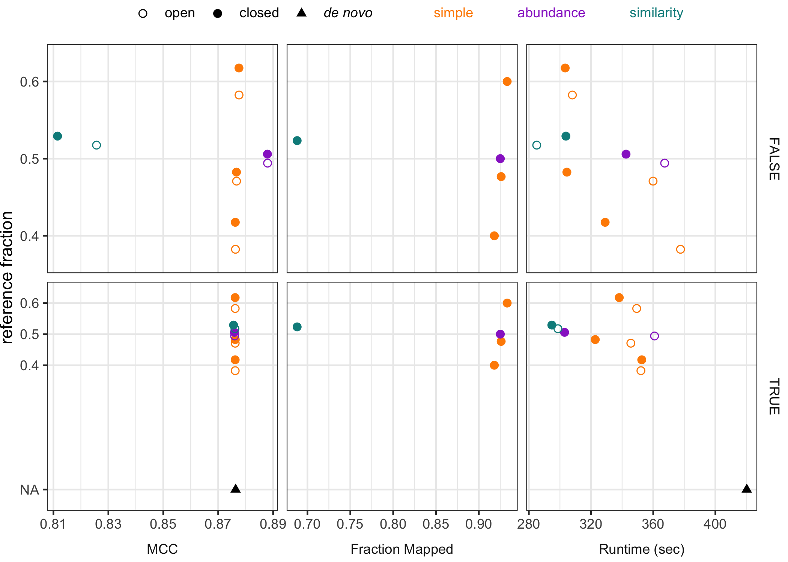
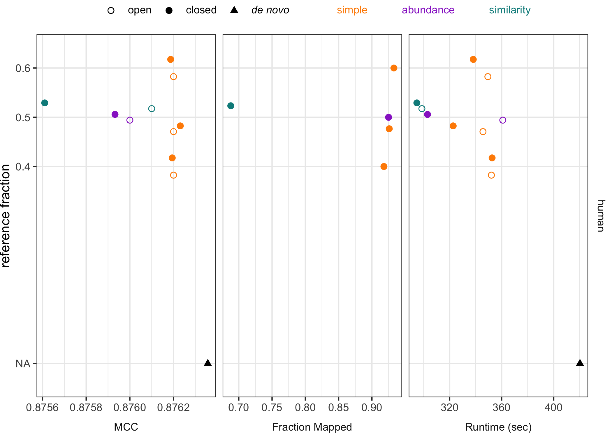

2021-10-22

# printref for split dataset strategy

With `printref=f` the reference sequences are not included in the final
MCC score, which makes sense when fitting to an independent database
like greengenes. but **for the split dataset strategy, wouldn’t it make
more sense to include ref seqs in the MCC to be a more comparable
comparison to de novo?**

``` r
set.seed(20211022)
library(cowplot)
library(ggtext)
library(glue)
library(here)
library(knitr)
library(tidyverse)

mutate_perf <- function(dat) {
  dat %>%
    mutate(
      mem_mb = max_rss,
      mem_gb = mem_mb / 1024
    ) %>%
    rename(sec = s)
}
select_cols <- function(dat) {
  dat %>%
    select(
      dataset, strategy, method, tool, mcc, sec, mem_gb, fraction_mapped,
      ref_frac, ref_weight, printref
    )
}
color_breaks <- list(
  simple = "#FF8C00",
  abundance = "#9932CC",
  similarity = "#008B8B"
)
color_labels <- lapply(
  names(color_breaks),
  function(name) {
    glue("<span style = 'color:{color_breaks[[name]]};'>{name}</span>")
  }
) %>% unlist()
color_values <- append(color_breaks, list(`NA` = "#000000"))
```

``` r
opticlust <- read_tsv(here("subworkflows/1_prep_samples/results/opticlust_results.tsv")) %>%
  full_join(read_tsv(here("subworkflows/1_prep_samples/results/dataset_sizes.tsv"))) %>%
  mutate_perf() %>%
  mutate(
    strategy = method,
    fraction_mapped = NA,
    ref_frac = 0,
    ref_weight = "NA",
    printref = TRUE
  )
optifit_split <- read_tsv(here("exploratory", "2021", "printref-test_2021-10", 
                               "data", "optifit_split_results.tsv")) %>%
  mutate_perf() %>%
  mutate(strategy = "self-split")

dat <- list(optifit_split, opticlust) %>%
  lapply(select_cols) %>%
  reduce(bind_rows) %>%
  mutate(
    method = as.character(method),
    strategy = as.character(strategy)
  ) %>%
  mutate(fraction_mapped = case_when(
    method %>% as.character() != "closed" ~ NA_real_,
    TRUE ~ fraction_mapped
  )) %>%
  pivot_longer(c(mcc, fraction_mapped, sec),
    names_to = "metric"
  ) %>%
  mutate(
    metric = factor(
      case_when(
        metric == "mcc" ~ "MCC",
        metric == "fraction_mapped" ~ "Fraction Mapped",
        metric == "sec" ~ "Runtime (sec)",
        TRUE ~ metric
      ),
      levels = c("MCC", "Fraction Mapped", "Runtime (sec)")
    ),
    strategy = factor(
      case_when(
        strategy == "de_novo" ~ "_de novo_",
        strategy == "database_rdp" ~ "db: RDP",
        strategy == "database_silva" ~ "db: SILVA",
        strategy == "database_gg" ~ "db: Greengenes",
        TRUE ~ strategy
      ),
      levels = c(
        "db: RDP", "db: SILVA", "db: Greengenes",
        "self-split", "_de novo_"
      )
    ),
    method = factor(
      case_when(
        method == "de_novo" ~ "_de novo_",
        TRUE ~ method
      ),
      levels = c("open", "closed", "_de novo_")
    ),
    ref_weight = factor(
      case_when(
        ref_weight == "distance" ~ "similarity",
        TRUE ~ ref_weight
      ),
      levels = c("simple", "abundance", "similarity", "NA")
    )
  )
```

## facet by printref

``` r
dat %>%
  filter(dataset == 'human') %>% 
  #filter(((ref_weight == "simple" | ref_frac == 0.5) | method == "_de novo_") & !is.na(value)) %>%
  ggplot(aes(ref_frac, value, color = ref_weight, shape = method)) +
  coord_flip() +
  stat_summary(
    geom = "point",
    fun = median,
    size = 2,
    position = position_dodge(width = 0.07)
  ) +
  facet_grid(printref ~ metric, scales = "free", switch = "x") +
  scale_shape_manual(values = list(open = 1, closed = 19, `_de novo_` = 17)) +
  scale_color_manual(
    values = color_values,
    breaks = names(color_breaks),
    labels = color_labels
  ) +
  scale_x_continuous(
    breaks = c(0, 0.4, 0.5, 0.6),
    labels = c("NA", 0.4, 0.5, 0.6)
  ) +
  labs(x = "reference fraction", y = "") +
  theme_bw() +
  theme(
    legend.text = element_markdown(),
    legend.title = element_blank(),
    legend.position = "top",
    legend.margin = margin(t = 0, r = 0, b = 0, l = 0, unit = "pt"),
    plot.margin = unit(x = c(0, 0, 0, 0), units = "pt"),
    panel.grid.minor.y = element_blank(),
    axis.title.x = element_blank(),
    strip.placement = "outside",
    strip.background = element_blank()
  ) +
  guides(
    shape = guide_legend(order = 1),
    colour = guide_legend(
      override.aes = list(size = -1),
      order = 2
    )
  )
```

    ## Warning: Removed 150 rows containing non-finite values (stat_summary).

<!-- -->

## printref=TRUE

``` r
dat %>%
  filter(printref & dataset == 'human') %>% 
  #filter(((ref_weight == "simple" | ref_frac == 0.5) | method == "_de novo_") & !is.na(value)) %>%
  ggplot(aes(ref_frac, value, color = ref_weight, shape = method)) +
  coord_flip() +
  stat_summary(
    geom = "point",
    fun = median,
    size = 2,
    position = position_dodge(width = 0.07)
  ) +
  facet_grid(dataset ~ metric, scales = "free", switch = "x") +
  scale_shape_manual(values = list(open = 1, closed = 19, `_de novo_` = 17)) +
  scale_color_manual(
    values = color_values,
    breaks = names(color_breaks),
    labels = color_labels
  ) +
  scale_x_continuous(
    breaks = c(0, 0.4, 0.5, 0.6),
    labels = c("NA", 0.4, 0.5, 0.6)
  ) +
  labs(x = "reference fraction", y = "") +
  theme_bw() +
  theme(
    legend.text = element_markdown(),
    legend.title = element_blank(),
    legend.position = "top",
    legend.margin = margin(t = 0, r = 0, b = 0, l = 0, unit = "pt"),
    plot.margin = unit(x = c(0, 0, 0, 0), units = "pt"),
    panel.grid.minor.y = element_blank(),
    axis.title.x = element_blank(),
    strip.placement = "outside",
    strip.background = element_blank()
  ) +
  guides(
    shape = guide_legend(order = 1),
    colour = guide_legend(
      override.aes = list(size = -1),
      order = 2
    )
  )
```

    ## Warning: Removed 125 rows containing non-finite values (stat_summary).

<!-- -->
