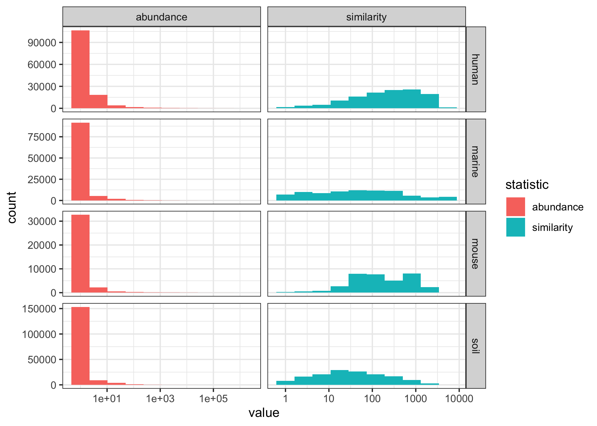
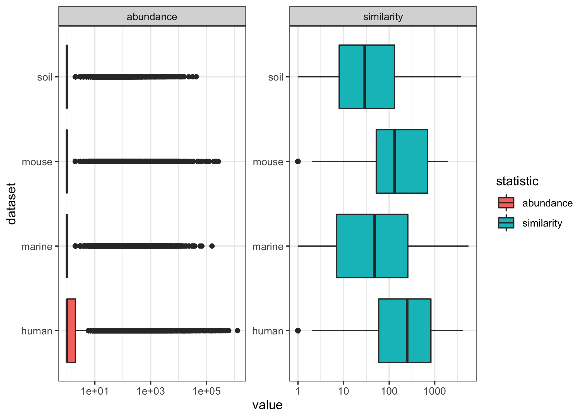
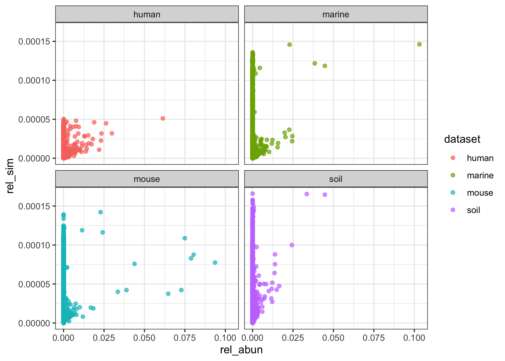
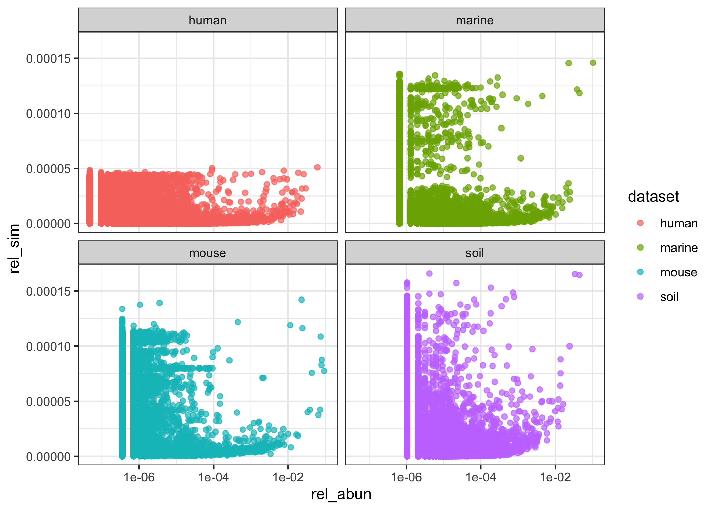
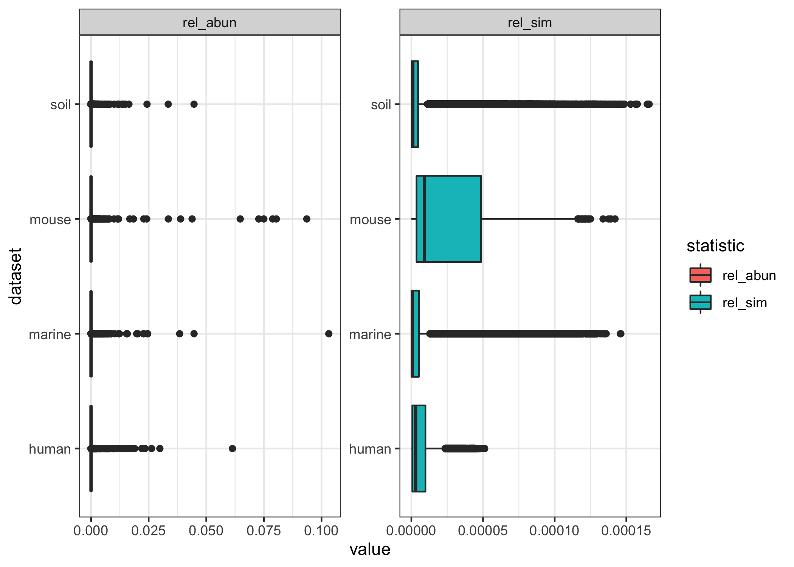
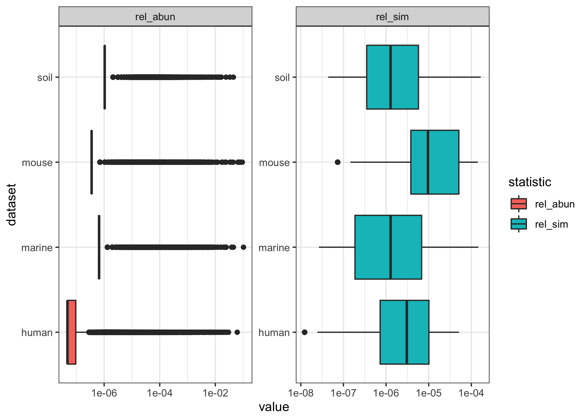
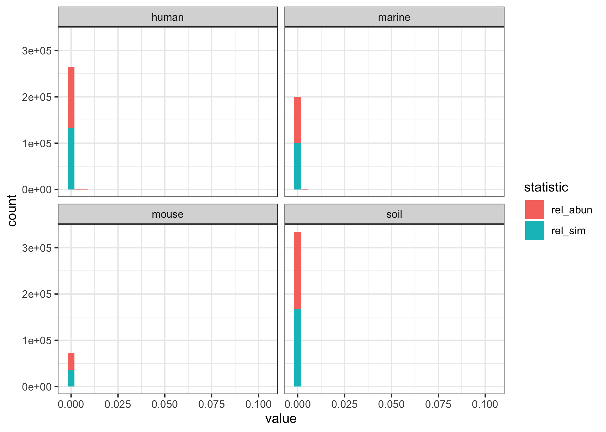
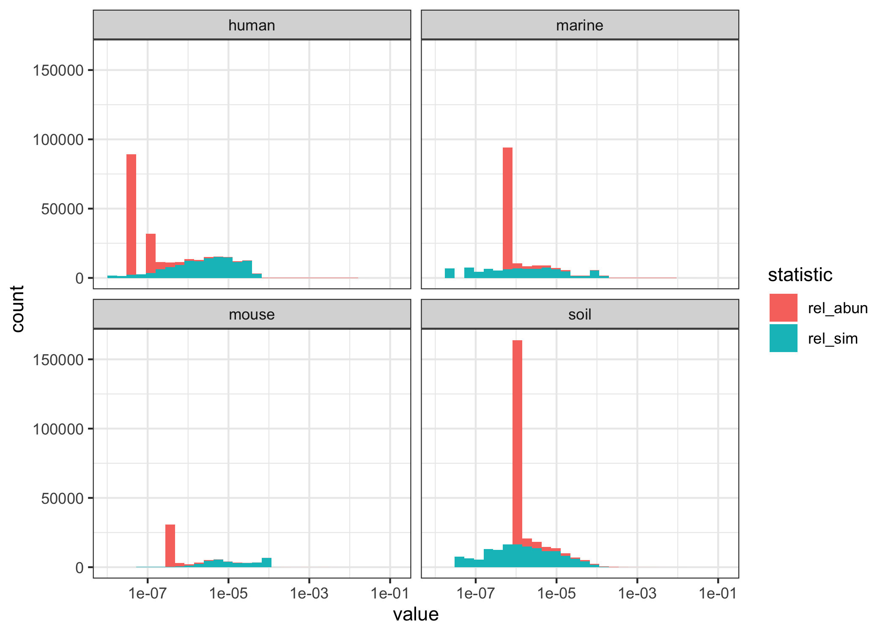

2021-10-22

# Similarity & Abundance of Sequences

Each sequence has an absolute abundance and similarity value, where
similarity is the count of other sequences within the dataset that it is
similar to per the 0.03 distance threshold. I was wondering if the
distributions of those values would have some pattern that corresponded
to what we see with the MCC scores for weighting by those methods. There
isn’t anything obviously weird or wrong. For all datasets most sequences
are very low abundance (expected). Both marine and soil have a much
lower median similarity value than human and mouse, and the marine and
soil datasets also have a huge spread in MCC between open & closed with
similarity weighting.

``` r
set.seed(20211021)
library(glue)
library(here)
library(tidyverse)
theme_set(theme_bw())
```

``` r
dataset_names <- c("human","marine","mouse","soil")
seq_stats <- dataset_names %>% map_dfr(function(x) {
  read_tsv(glue('subworkflows/1_prep_samples/data/{x}/seq_stats.tsv')) %>% 
    mutate(dataset = x)
}) %>% pivot_longer(c(similarity, abundance), names_to = 'statistic')
```

### histograms

``` r
seq_stats %>% 
  ggplot(aes(x=value, fill=statistic)) +
  geom_histogram() +
  facet_grid(dataset ~ statistic, scales='free')
```

<!-- -->

``` r
seq_stats %>% 
  ggplot(aes(x=value, fill=statistic)) +
  geom_histogram() +
  scale_x_log10() +
  facet_wrap("dataset")
```

    ## Warning: Transformation introduced infinite values in continuous x-axis

    ## Warning: Removed 34675 rows containing non-finite values (stat_bin).

<!-- -->

``` r
seq_stats %>% 
  ggplot(aes(x=value, fill=statistic)) +
  geom_histogram(bins=10) +
  scale_x_log10() +
  facet_grid(dataset ~ statistic, scales='free')
```

    ## Warning: Transformation introduced infinite values in continuous x-axis

    ## Warning: Removed 34675 rows containing non-finite values (stat_bin).

<!-- -->

### boxplots

``` r
seq_stats %>% 
  ggplot(aes(x=value, y=dataset, fill=statistic)) +
  geom_boxplot() +
  facet_wrap('statistic', scales = 'free')
```

<!-- -->

``` r
seq_stats %>% 
  ggplot(aes(x=value, y=dataset, fill=statistic)) +
  geom_boxplot() +
  scale_x_log10() +
  facet_wrap('statistic', scales = 'free')
```

    ## Warning: Transformation introduced infinite values in continuous x-axis

    ## Warning: Removed 34675 rows containing non-finite values (stat_boxplot).

<!-- -->

### abundance vs similarity

``` r
seq_stats %>% 
  pivot_wider(names_from = statistic) %>% 
  ggplot(aes(x = abundance, y = similarity, color = dataset)) +
  geom_point(alpha=0.7) +
  scale_x_log10() +
  facet_wrap('dataset')
```

<!-- -->

## relative abundance & simlarity

``` r
totals <- seq_stats %>%
  pivot_wider(names_from = statistic) %>% 
  group_by(dataset) %>% 
  summarize(tot_simi = sum(similarity),
            tot_abun = sum(abundance))

rel_stats <- dataset_names %>% map_dfr(function(x) {
  read_tsv(glue('subworkflows/1_prep_samples/data/{x}/seq_stats.tsv')) %>% 
    mutate(dataset = x,
           rel_sim = similarity / (totals %>% 
                                     filter(dataset == x) %>% 
                                     pull(tot_simi)),
           rel_abun = abundance / (totals %>% 
                                     filter(dataset == x) %>% 
                                     pull(tot_abun))
           )
})
```

### rel abun vs rel sim

``` r
rel_stats %>% 
  ggplot(aes(x = rel_abun, y = rel_sim, color = dataset)) +
  geom_point(alpha=0.7) +
  facet_wrap('dataset')
```

<!-- -->

``` r
rel_stats %>% 
  ggplot(aes(x = rel_abun, y = rel_sim, color = dataset)) +
  geom_point(alpha=0.7) +
  scale_x_log10() +
  facet_wrap('dataset')
```

<!-- -->

### relative boxplots

``` r
rel_stats %>% pivot_longer(c(rel_sim, rel_abun), names_to = 'statistic') %>% 
  ggplot(aes(x=value, y=dataset, fill=statistic)) +
  geom_boxplot() +
  facet_wrap('statistic', scales = 'free')
```

<!-- -->

``` r
rel_stats %>% pivot_longer(c(rel_sim, rel_abun), names_to = 'statistic') %>% 
  ggplot(aes(x=value, y=dataset, fill=statistic)) +
  geom_boxplot() +
  scale_x_log10() +
  facet_wrap('statistic', scales = 'free')
```

    ## Warning: Transformation introduced infinite values in continuous x-axis

    ## Warning: Removed 34675 rows containing non-finite values (stat_boxplot).

<!-- -->

### relative histograms

``` r
rel_stats %>%  pivot_longer(c(rel_sim, rel_abun), names_to = 'statistic') %>% 
  ggplot(aes(x=value, fill=statistic)) +
  geom_histogram() +
  facet_wrap("dataset")
```

<!-- -->

``` r
rel_stats %>%  pivot_longer(c(rel_sim, rel_abun), names_to = 'statistic') %>% 
  ggplot(aes(x=value, fill=statistic)) +
  geom_histogram() +
  scale_x_log10() +
  facet_wrap("dataset")
```

    ## Warning: Transformation introduced infinite values in continuous x-axis

    ## Warning: Removed 34675 rows containing non-finite values (stat_bin).

<!-- -->

## summary stats

``` r
rel_stats %>% 
  group_by(dataset) %>% 
  summarize_at(vars(abundance), 
               list(min=min, median=median, mean=mean, max=max)) %>% 
  knitr::kable()
```

| dataset | min | median |      mean |     max |
|:--------|----:|-------:|----------:|--------:|
| human   |   1 |      1 | 158.58380 | 1286715 |
| marine  |   1 |      1 |  15.16795 |  156918 |
| mouse   |   1 |      1 |  78.77425 |  264594 |
| soil    |   1 |      1 |   5.71222 |   42712 |

``` r
rel_stats %>% 
  group_by(dataset) %>% 
  summarize_at(vars(similarity), 
               list(min=min, median=median, mean=mean, max=max)) %>% 
  knitr::kable()
```

| dataset | min | median |     mean |  max |
|:--------|----:|-------:|---------:|-----:|
| human   |   0 |    239 | 614.9974 | 4159 |
| marine  |   0 |     26 | 374.8955 | 5495 |
| mouse   |   0 |    125 | 380.7253 | 1941 |
| soil    |   0 |     22 | 136.0720 | 3778 |

``` r
quantile_custom <- function(x, by = 0.05) {
  x %>% 
    quantile(., seq.int(from = 0.1, to = 1, by = by))
}
get_quantile <- function(dat, dataset_name, var = abundance) {
  quantiles <- dat %>% 
    filter(dataset == dataset_name) %>% 
    pull({{ var }}) %>%  
    quantile_custom()
  data.frame(quant = names(quantiles), 
             value = quantiles, 
             row.names = NULL) %>% 
    mutate(dataset = dataset_name)
}
get_dataset_quantiles <- function(dat, column = abundance) {
  dataset_names %>% 
    map_dfr(function(x) {get_quantile(dat = dat, 
                                    dataset_name = x,
                                    var = {{column}})
                         }) %>% 
    pivot_wider(names_from = dataset, values_from = value) 
}
```

### abundance quantiles

``` r
rel_stats %>% 
  get_dataset_quantiles(column = abundance) %>% 
  knitr::kable()
```

| quant |   human | marine |  mouse |  soil |
|:------|--------:|-------:|-------:|------:|
| 10%   |       1 |      1 |      1 |     1 |
| 15%   |       1 |      1 |      1 |     1 |
| 20%   |       1 |      1 |      1 |     1 |
| 25%   |       1 |      1 |      1 |     1 |
| 30%   |       1 |      1 |      1 |     1 |
| 35%   |       1 |      1 |      1 |     1 |
| 40%   |       1 |      1 |      1 |     1 |
| 45%   |       1 |      1 |      1 |     1 |
| 50%   |       1 |      1 |      1 |     1 |
| 55%   |       1 |      1 |      1 |     1 |
| 60%   |       1 |      1 |      1 |     1 |
| 65%   |       1 |      1 |      1 |     1 |
| 70%   |       2 |      1 |      1 |     1 |
| 75%   |       2 |      1 |      1 |     1 |
| 80%   |       2 |      1 |      1 |     1 |
| 85%   |       3 |      1 |      2 |     1 |
| 90%   |       5 |      2 |      2 |     2 |
| 95%   |      13 |      6 |      5 |     5 |
| 100%  | 1286715 | 156918 | 264594 | 42712 |

### similarity quantiles

``` r
rel_stats %>% 
  get_dataset_quantiles(column = similarity) %>% 
  knitr::kable()
```

| quant | human | marine | mouse |   soil |
|:------|------:|-------:|------:|-------:|
| 10%   |    12 |      0 |    21 |    0.0 |
| 15%   |    22 |      1 |    31 |    2.0 |
| 20%   |    35 |      1 |    40 |    3.0 |
| 25%   |    53 |      2 |    49 |    5.0 |
| 30%   |    76 |      4 |    60 |    7.0 |
| 35%   |   101 |      6 |    72 |    9.0 |
| 40%   |   134 |     10 |    86 |   13.0 |
| 45%   |   181 |     16 |   102 |   17.0 |
| 50%   |   239 |     26 |   125 |   22.0 |
| 55%   |   305 |     40 |   173 |   29.0 |
| 60%   |   403 |     59 |   226 |   40.0 |
| 65%   |   509 |     88 |   335 |   54.0 |
| 70%   |   641 |    135 |   472 |   74.0 |
| 75%   |   798 |    197 |   664 |  106.0 |
| 80%   |  1052 |    285 |   845 |  159.0 |
| 85%   |  1398 |    442 |   991 |  233.0 |
| 90%   |  2058 |    742 |  1172 |  376.8 |
| 95%   |  2572 |   2962 |  1399 |  702.0 |
| 100%  |  4159 |   5495 |  1941 | 3778.0 |
