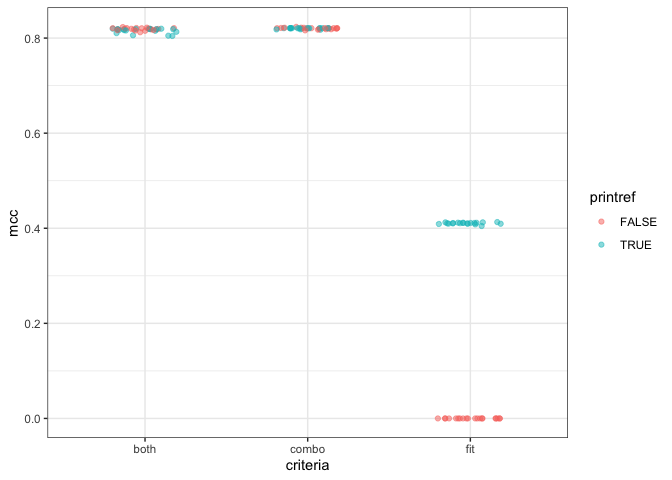
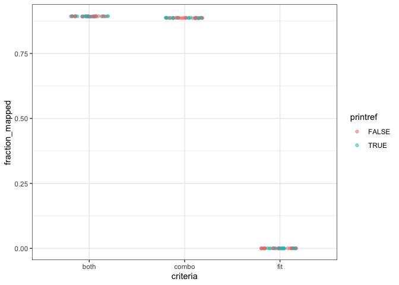

2021-03-24

``` r
set.seed(2018)
library(cowplot)
library(ggtext)
library(glue)
library(here)
library(knitr)
library(tidyverse)

theme_set(theme_bw())

mutate_perf <- function(dat) {
  dat %>% 
    mutate(mem_mb = max_rss,
           mem_gb = mem_mb / 1024) %>% 
    rename(sec = s)
}
```

``` r
dat <- read_tsv(here('subworkflows', '3_fit_sample_split', 'results', 
                     'optifit_crit_check.tsv')) %>% 
  mutate_perf() %>% 
  select(dataset, printref, criteria, mcc, fraction_mapped, sec, mem_gb)
```

## OTU Quality

``` r
dat %>% 
  ggplot(aes(x = criteria, y = mcc, color = printref)) +
  geom_point(alpha = 0.5) +
  ylim(0, 1)
```

<!-- -->

## Fraction mapped

``` r
dat %>% 
  ggplot(aes(x = criteria, y = fraction_mapped, color = printref)) +
  geom_point(alpha = 0.5) +
  ylim(0, 1)
```

<!-- -->
