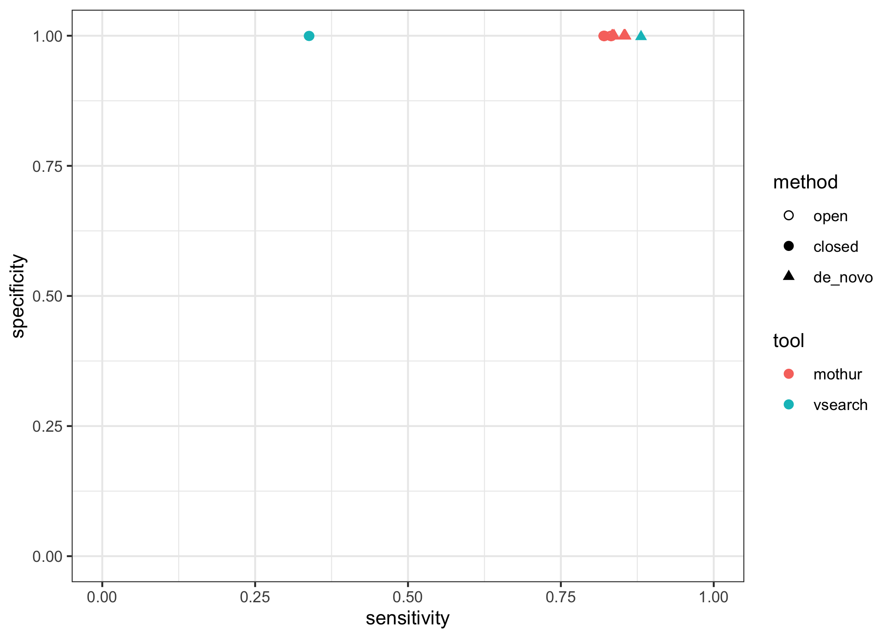
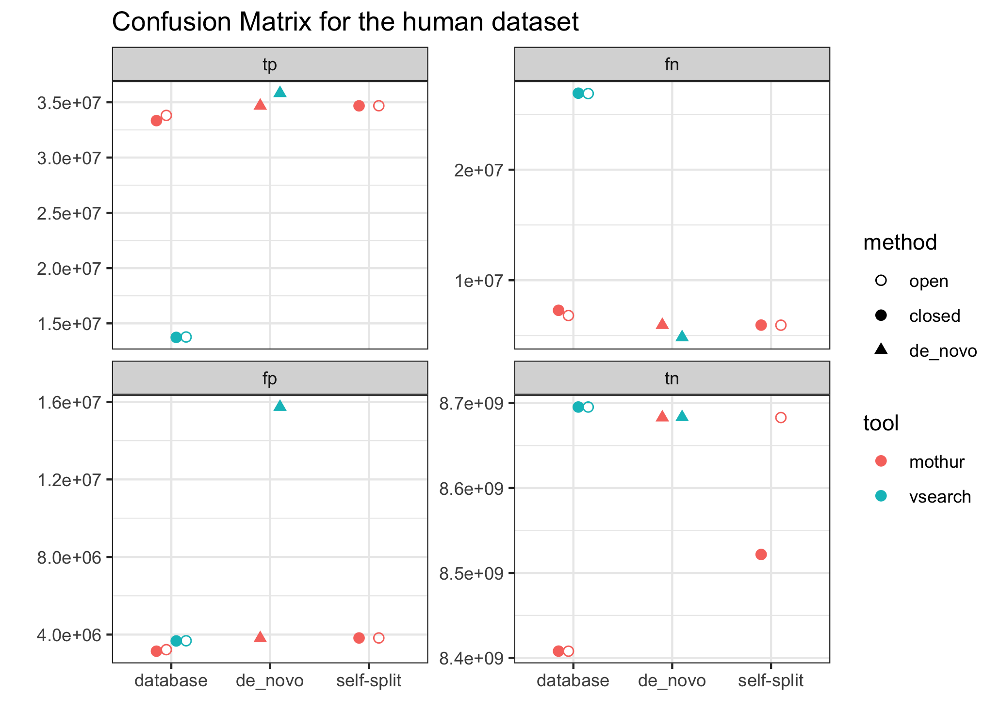

2022-01-13

# Sensitivity & Specificity

``` r
set.seed(2020112)
library(glue)
library(here)
library(tidyverse)
theme_set(theme_bw())
```

``` r
dat_agg <- read_tsv(here('results', 'aggregated.tsv'))
```

``` r
dat_agg %>% 
  filter(dataset == 'human', 
         ref == 'gg' | method == 'de_novo') %>% 
  ggplot(aes(sensitivity, specificity, color = tool, shape = method)) +
  stat_summary(
    geom = "point",
    fun = median,
    size = 2
  ) +
  scale_shape_manual(values = list(open = 1, closed = 19, de_novo = 17)) +
  ylim(0, 1) + xlim(0, 1)
```

<!-- -->

``` r
dat_agg %>% 
  filter(dataset == 'human', 
         ref == 'gg' | strategy != 'database') %>%
  pivot_longer(c(tp, tn, fp, fn), 
               names_to = 'conf_mat_quad', 
               values_to = 'conf_mat_val') %>%
  mutate(conf_mat_quad = factor(conf_mat_quad, 
                                levels = c('tp', 'fn', 'fp', 'tn'))) %>% 
  # mutate(tool_method = factor(glue("{tool}_{method}"),
  #                             levels = c("mothur_de_novo", "vsearch_de_novo",
  #                                        "mothur_closed", "vsearch_closed",
  #                                        "mothur_open", "vsearch_open"))
  #        ) %>% 
  ggplot(aes(
    strategy,
    conf_mat_val,
    color = tool,
    shape = method
  )) +
  facet_wrap("conf_mat_quad", 
             scales = 'free_y',
             nrow = 2) +
  stat_summary(
    geom = "point",
    fun = median,
    size = 2,
    position = position_dodge(width = 0.4)
  ) +
  scale_shape_manual(values = list(
    open = 1,
    closed = 19,
    de_novo = 17
  )) +
  labs(y = '', x = '', title = 'Confusion Matrix for the human dataset')
```

<!-- -->
